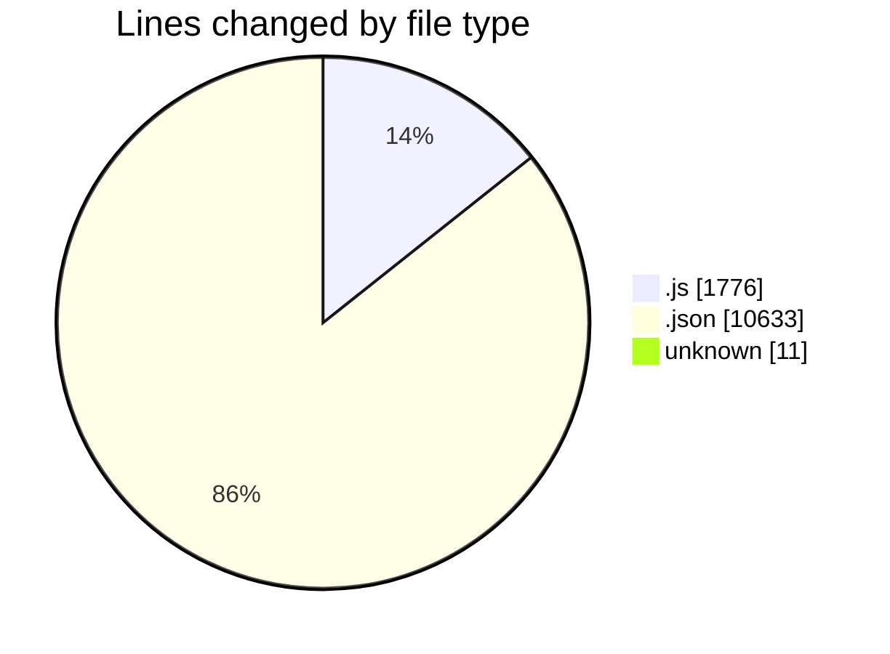
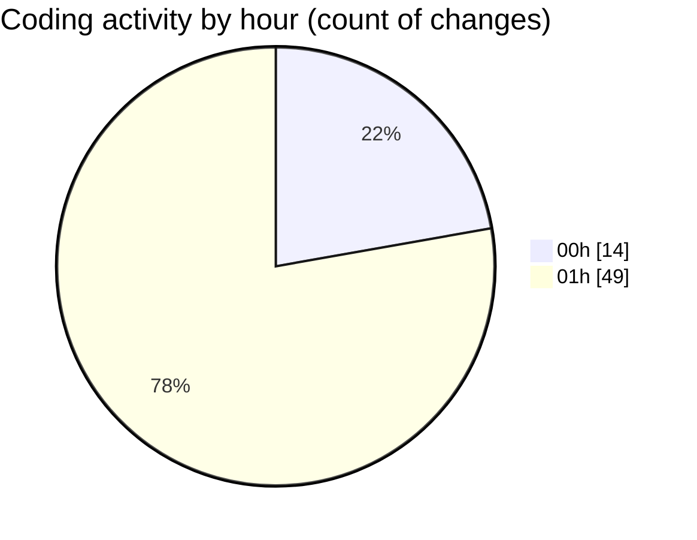

# good-pr - Activity Summary 

## Overall Statistics

| Stat                   | Value                                                             |
| ---------------------- | ----------------------------------------------------------------- |
| **Lines Added** (➕)   | 12395                                          |
| **Lines Removed** (➖) | 25                                        |
| **Net Change** (↕)    | 12370                |
| **Active Time** (⌚)   | 82 minutes |

## Modified Files
- **updateRepository.js** (+20, -0)
- **settings.json** (+67, -0)
- **package.json** (+51, -1)
- **package-lock.json** (+7850, -0)
- **.eslintrc.json** (+38, -7)
- **fetchData.js** (+78, -5)
- **SidebarDashboard.js** (+69, -2)
- **IssuesActivityCard.js** (+321, -0)
- **TeamActivityPie.js** (+393, -1)
- **layout.js** (+33, -0)
- **ProjectCard.js** (+144, -0)
- **ShareButton.js** (+40, -0)
- **Dashboard.js** (+106, -0)
- **TeamCard.js** (+152, -5)
- **GroupsPage.js** (+98, -2)
- **page.js** (+143, -1)
- **AlertIcon.js** (+24, -0)
- **gitHubAPI.js** (+110, -0)
- **postcss.config.js** (+7, -0)
- **Tooltips.js** (+21, -1)
- **g1-e-commerce.json** (+2619, -0)
- **.prettierrc** (+11, -0)

## Visualizations

### By File Type (Lines Changed)

### By Hour (Estimated Activity Count)

> **Last Updated:** 11/01/2025, 02:02:15