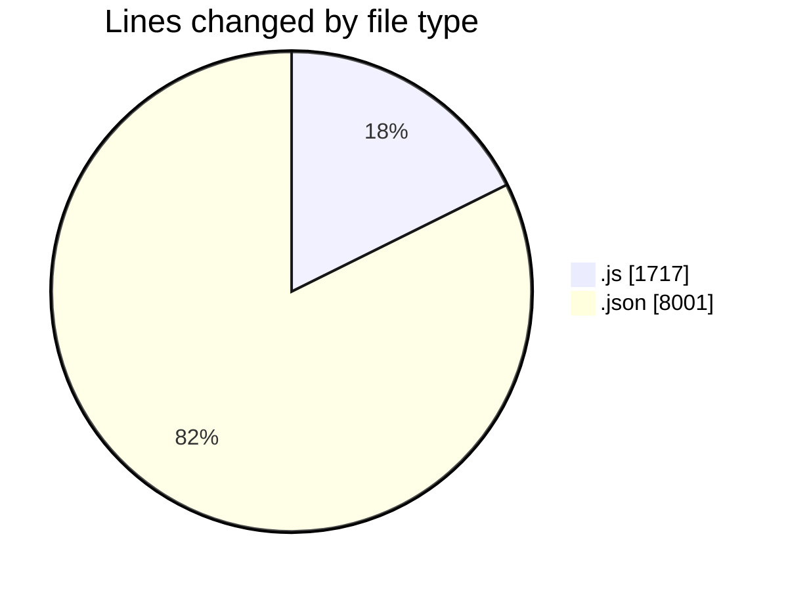
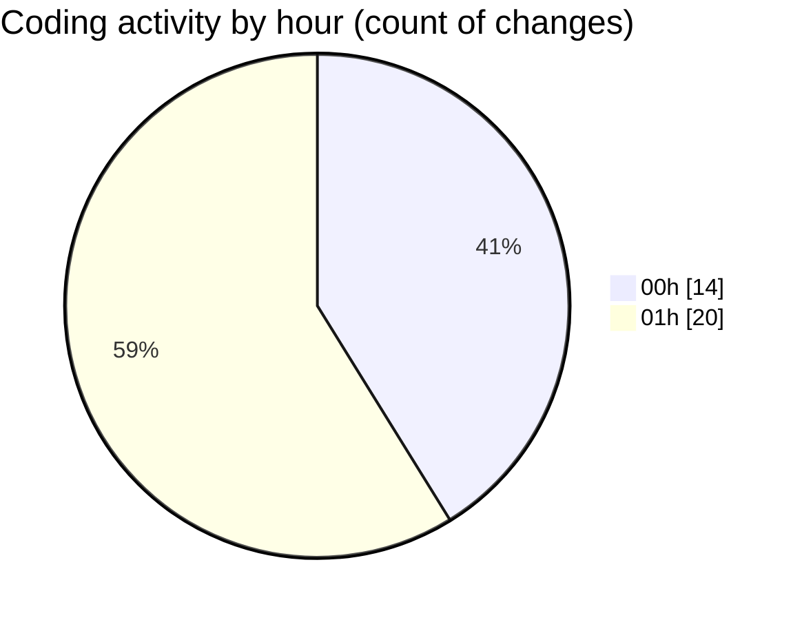

# good-pr - Activity Summary 

## Overall Statistics

| Stat                   | Value                                                             |
| ---------------------- | ----------------------------------------------------------------- |
| **Lines Added** (➕)   | 9708                                          |
| **Lines Removed** (➖) | 10                                        |
| **Net Change** (↕)    | 9698                |
| **Active Time** (⌚)   | 54 minutes |

## Modified Files
- **updateRepository.js** (+20, -0)
- **settings.json** (+67, -0)
- **package.json** (+51, -1)
- **package-lock.json** (+7850, -0)
- **.eslintrc.json** (+31, -1)
- **fetchData.js** (+76, -4)
- **SidebarDashboard.js** (+60, -0)
- **IssuesActivityCard.js** (+319, -0)
- **TeamActivityPie.js** (+391, -0)
- **layout.js** (+33, -0)
- **ProjectCard.js** (+144, -0)
- **ShareButton.js** (+40, -0)
- **Dashboard.js** (+106, -0)
- **TeamCard.js** (+147, -2)
- **GroupsPage.js** (+90, -2)
- **page.js** (+143, -0)
- **AlertIcon.js** (+24, -0)
- **gitHubAPI.js** (+109, -0)
- **postcss.config.js** (+7, -0)

## Visualizations

### By File Type (Lines Changed)

### By Hour (Estimated Activity Count)

> **Last Updated:** 11/01/2025, 01:07:14