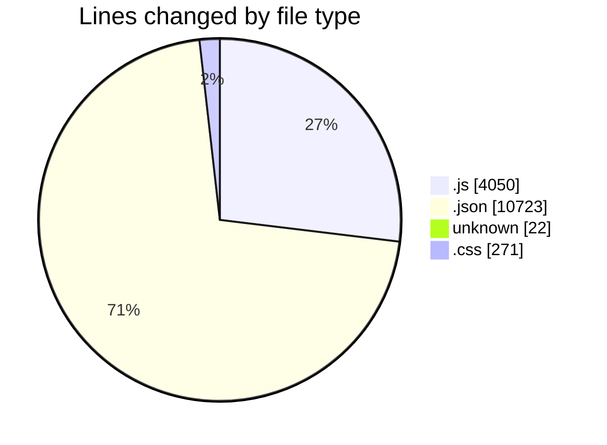
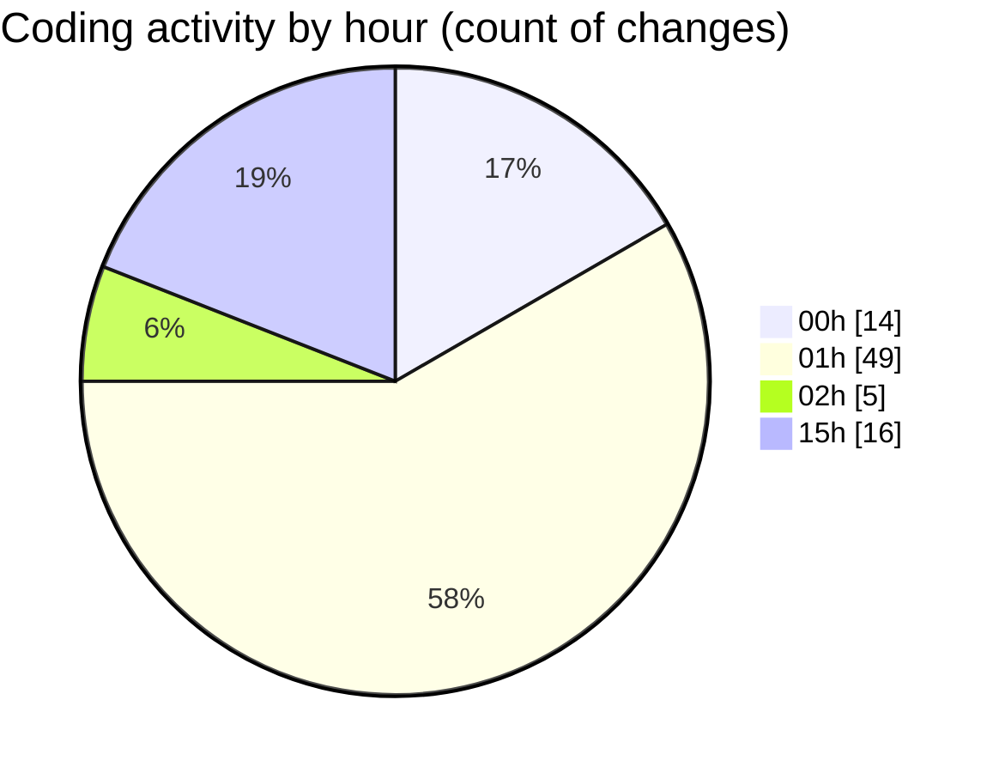

# good-pr - Activity Summary 

## Overall Statistics

| Stat                   | Value                                                             |
| ---------------------- | ----------------------------------------------------------------- |
| **Lines Added** (➕)   | 14612                                          |
| **Lines Removed** (➖) | 454                                        |
| **Net Change** (↕)    | 14158                |
| **Active Time** (⌚)   | 106 minutes |

## Modified Files
- **updateRepository.js** (+20, -0)
- **settings.json** (+67, -0)
- **package.json** (+101, -1)
- **package-lock.json** (+7850, -0)
- **.eslintrc.json** (+69, -7)
- **fetchData.js** (+78, -5)
- **SidebarDashboard.js** (+138, -6)
- **IssuesActivityCard.js** (+962, -320)
- **TeamActivityPie.js** (+785, -1)
- **layout.js** (+33, -0)
- **ProjectCard.js** (+288, -0)
- **ShareButton.js** (+40, -0)
- **Dashboard.js** (+209, -105)
- **TeamCard.js** (+298, -5)
- **GroupsPage.js** (+98, -2)
- **page.js** (+143, -1)
- **AlertIcon.js** (+24, -0)
- **gitHubAPI.js** (+220, -0)
- **postcss.config.js** (+14, -0)
- **Tooltips.js** (+42, -1)
- **g1-e-commerce.json** (+2619, -0)
- **.prettierrc** (+22, -0)
- **jsconfig.json** (+9, -0)
- **page.module.css** (+230, -0)
- **globals.css** (+41, -0)
- **TasksActivity.js** (+212, -0)

## Visualizations

### By File Type (Lines Changed)

### By Hour (Estimated Activity Count)

> **Last Updated:** 11/01/2025, 15:37:09