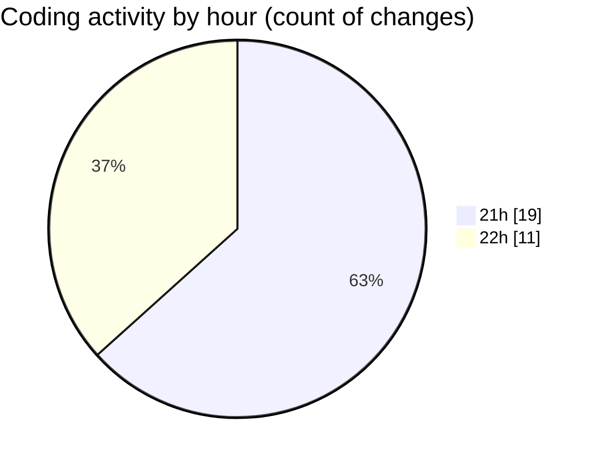

# github-activity-tracker - Activity Summary 

## Overall Statistics

| Stat                   | Value                                                             |
| ---------------------- | ----------------------------------------------------------------- |
| **Lines Added** (➕)   | 244                                          |
| **Lines Removed** (➖) | 17                                        |
| **Net Change** (↕)    | 227                |
| **Active Time** (⌚)   | 52 minutes |

## Modified Files
- **tokenCache.ts** (+23, -0)
- **oauthService.ts** (+20, -0)
- **githubService.ts** (+52, -10)
- **webhookController.ts** (+66, -0)
- **authController.ts** (+54, -7)
- **index.ts** (+29, -0)

## Visualizations

### By File Type (Lines Changed)

### By Hour (Estimated Activity Count)

> **Last Updated:** 14/01/2025, 22:59:46