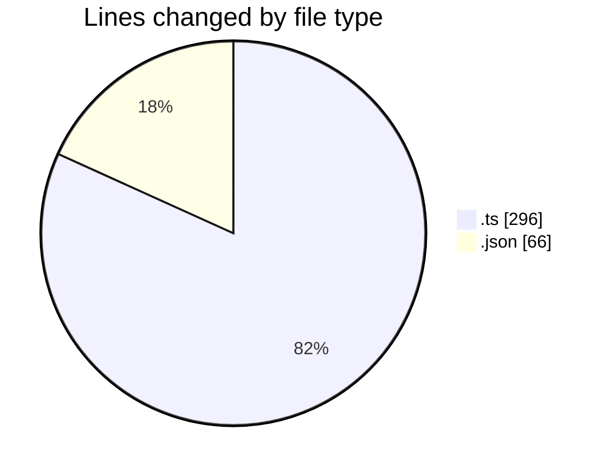
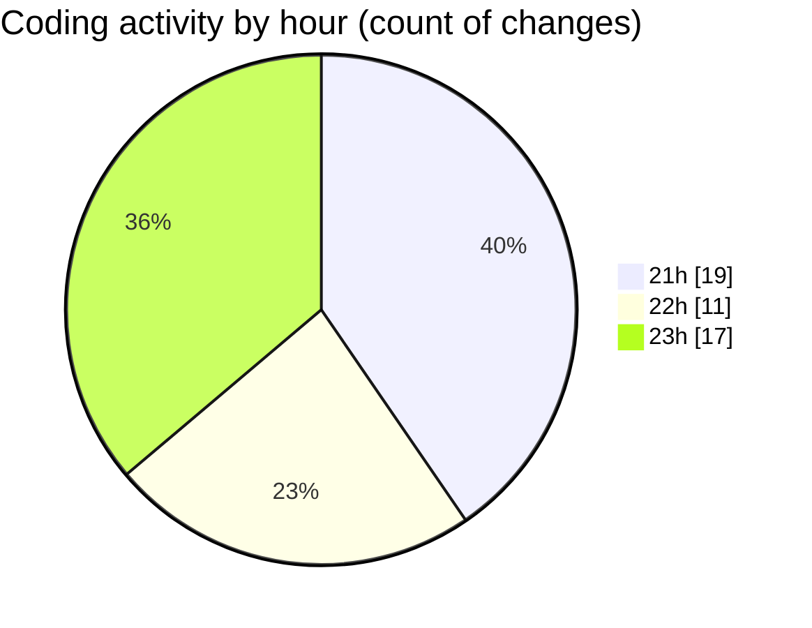

# github-activity-tracker - Activity Summary 

## Overall Statistics

| Stat                   | Value                                                             |
| ---------------------- | ----------------------------------------------------------------- |
| **Lines Added** (➕)   | 329                                          |
| **Lines Removed** (➖) | 33                                        |
| **Net Change** (↕)    | 296                |
| **Active Time** (⌚)   | 84 minutes |

## Modified Files
- **tokenCache.ts** (+23, -0)
- **oauthService.ts** (+20, -0)
- **githubService.ts** (+68, -22)
- **webhookController.ts** (+68, -3)
- **authController.ts** (+54, -7)
- **index.ts** (+30, -1)
- **package.json** (+42, -0)
- **tsconfig.json** (+24, -0)

## Visualizations

### By File Type (Lines Changed)

### By Hour (Estimated Activity Count)

> **Last Updated:** 14/01/2025, 23:49:46