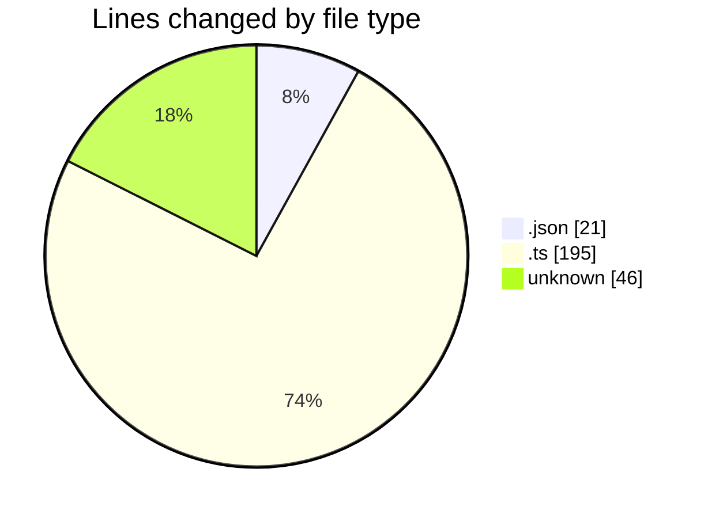
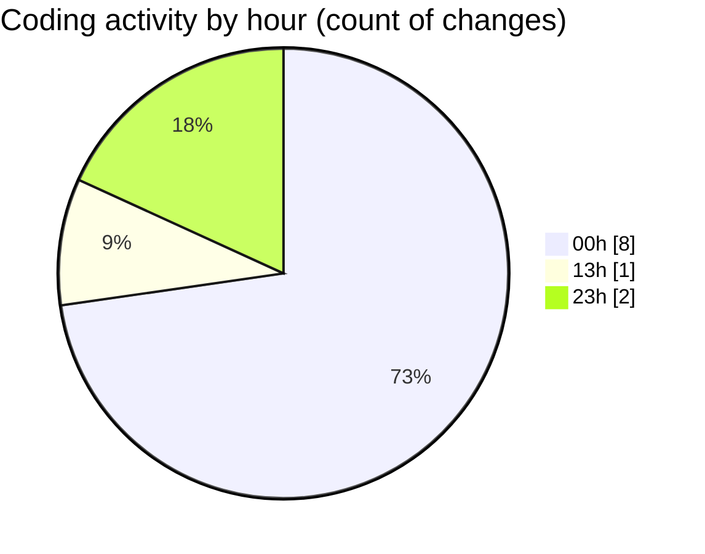

# github-activity-tracker - Activity Summary 

## Overall Statistics

| Stat                   | Value                                                             |
| ---------------------- | ----------------------------------------------------------------- |
| **Lines Added** (➕)   | 238                                          |
| **Lines Removed** (➖) | 24                                        |
| **Net Change** (↕)    | 214                |
| **Active Time** (⌚)   | 18 minutes |

## Modified Files
- **tsconfig.json** (+21, -0)
- **index.ts** (+38, -9)
- **githubService.ts** (+61, -15)
- **index.ts** (+25, -0)
- **authController.ts** (+47, -0)
- **.env** (+46, -0)

## Visualizations

### By File Type (Lines Changed)

### By Hour (Estimated Activity Count)

> **Last Updated:** 15/01/2025, 13:16:05