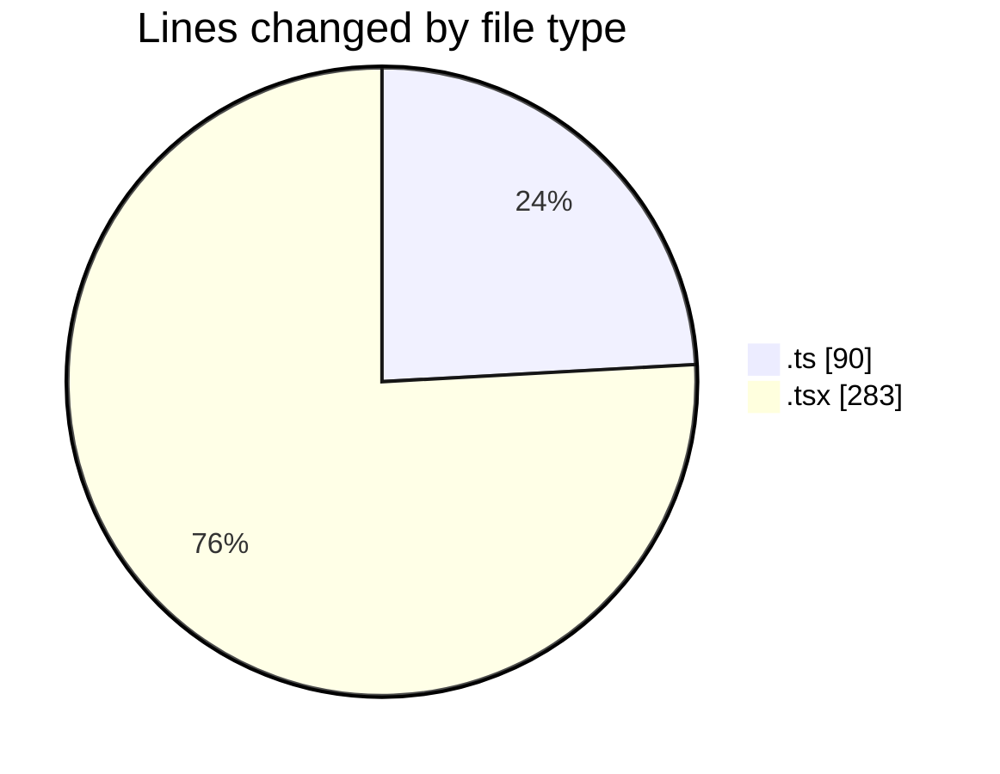
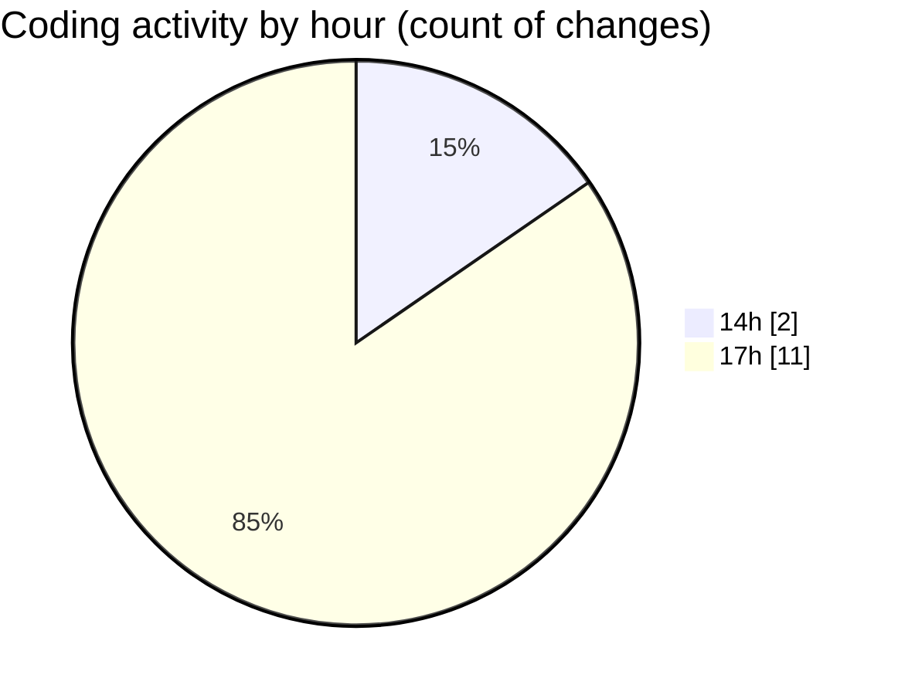

# pdf-analysis-app - Activity Summary 

## Overall Statistics

| Stat                   | Value                                                             |
| ---------------------- | ----------------------------------------------------------------- |
| **Lines Added** (➕)   | 372                                          |
| **Lines Removed** (➖) | 1                                        |
| **Net Change** (↕)    | 371                |
| **Active Time** (⌚)   | 14 minutes |

## Modified Files
- **api.ts** (+75, -0)
- **socket.ts** (+14, -1)
- **Home.tsx** (+114, -0)
- **FileUpload.tsx** (+169, -0)

## Visualizations

### By File Type (Lines Changed)

### By Hour (Estimated Activity Count)

> **Last Updated:** 25/01/2025, 18:03:23