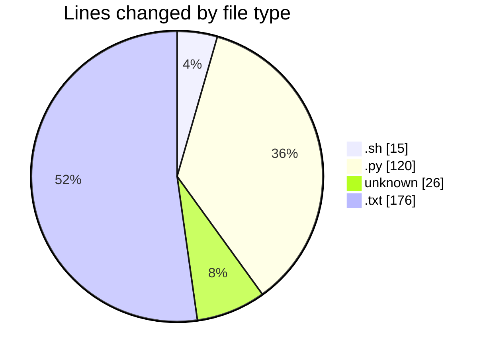
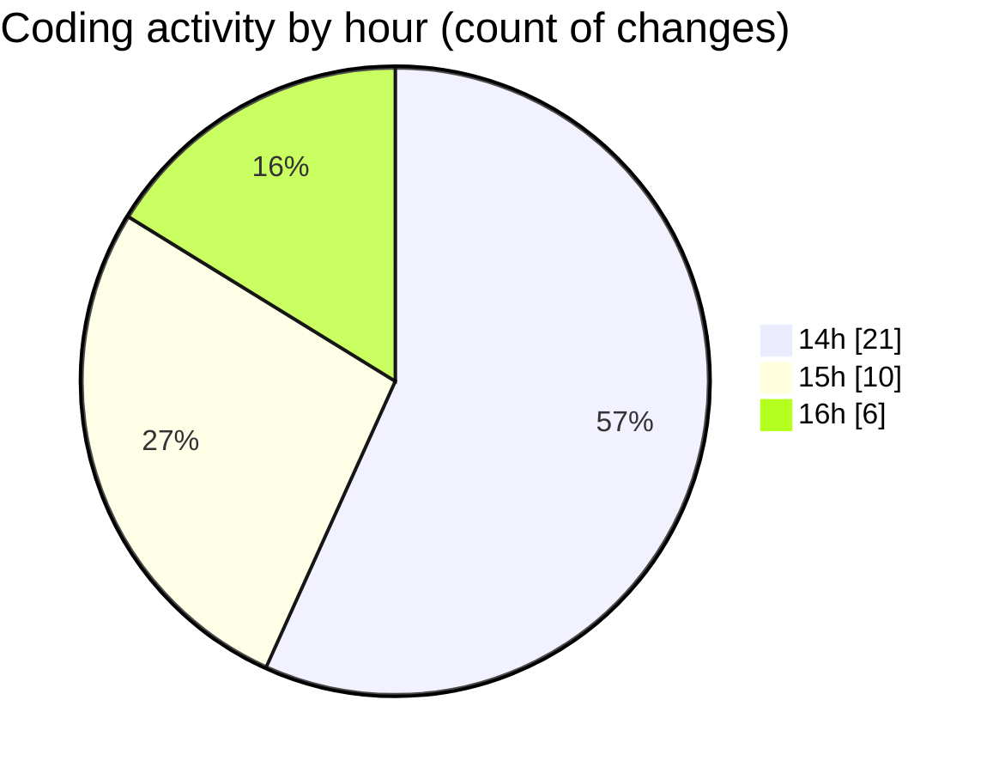

# samplePdf - Activity Summary 

## Overall Statistics

| Stat                   | Value                                                             |
| ---------------------- | ----------------------------------------------------------------- |
| **Lines Added** (➕)   | 251                                          |
| **Lines Removed** (➖) | 86                                        |
| **Net Change** (↕)    | 165                |
| **Active Time** (⌚)   | 66 minutes |

## Modified Files
- **entrypoint.sh** (+11, -4)
- **app.py** (+84, -13)
- **.env** (+9, -0)
- **config.py** (+20, -0)
- **gunicorn.conf.py** (+3, -0)
- **Dockerfile** (+17, -0)
- **requirements.txt** (+107, -69)

## Visualizations

### By File Type (Lines Changed)

### By Hour (Estimated Activity Count)

> **Last Updated:** 25/01/2025, 16:53:26