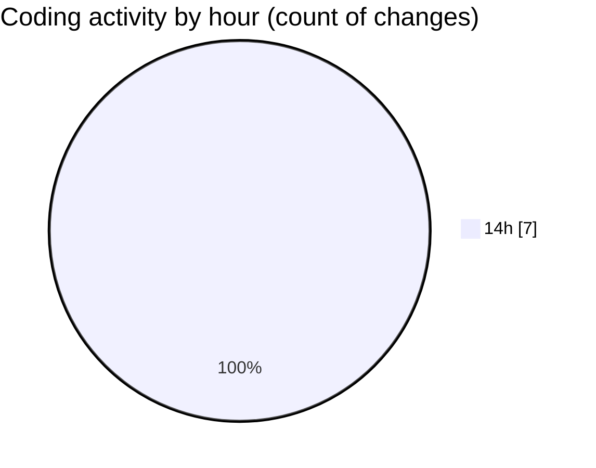

# samplePdf - Activity Summary 

## Overall Statistics

| Stat                   | Value                                                             |
| ---------------------- | ----------------------------------------------------------------- |
| **Lines Added** (➕)   | 79                                          |
| **Lines Removed** (➖) | 1                                        |
| **Net Change** (↕)    | 78                |
| **Active Time** (⌚)   | 15 minutes |

## Modified Files
- **entrypoint.sh** (+11, -0)
- **app.py** (+68, -1)

## Visualizations

### By File Type (Lines Changed)

### By Hour (Estimated Activity Count)

> **Last Updated:** 25/01/2025, 14:33:26