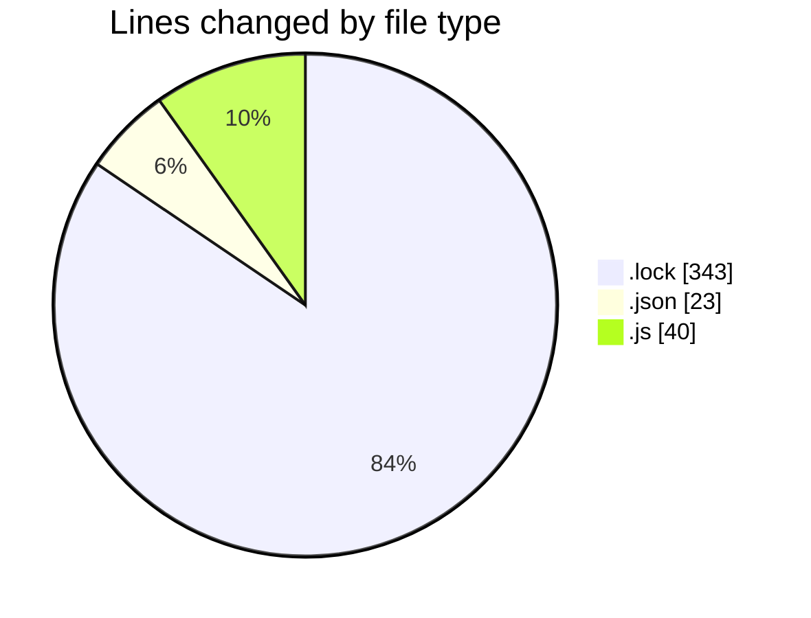
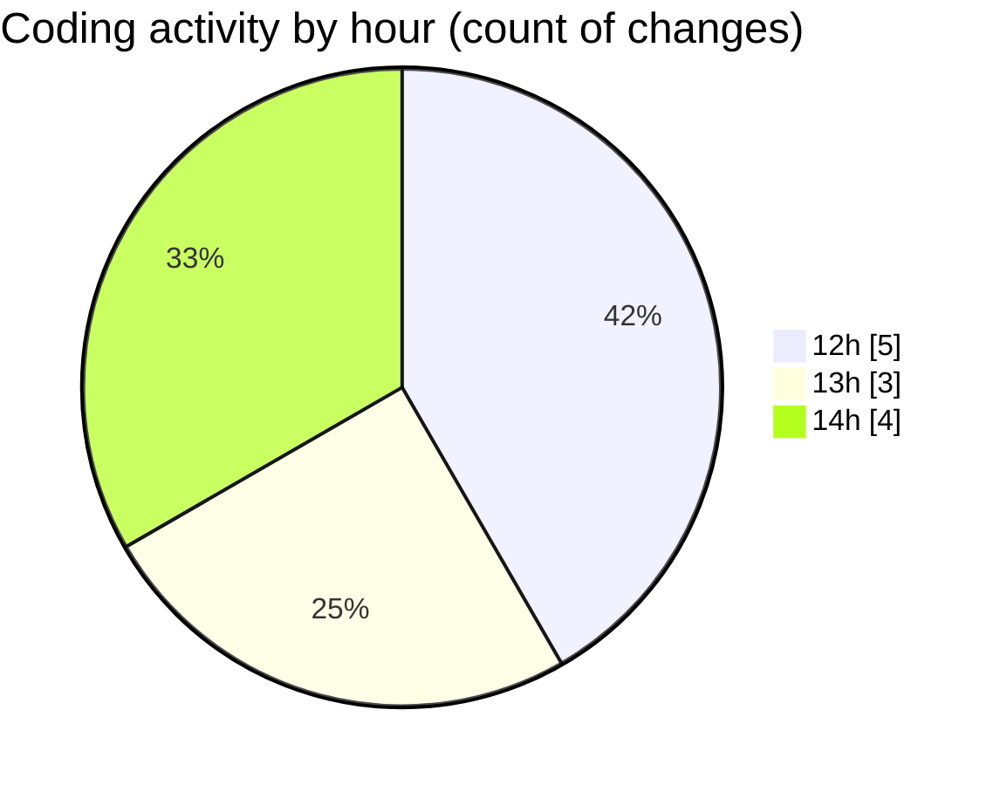

# cda - Activity Summary 

## Overall Statistics

| Stat                   | Value                                                             |
| ---------------------- | ----------------------------------------------------------------- |
| **Lines Added** (➕)   | 328                                          |
| **Lines Removed** (➖) | 78                                        |
| **Net Change** (↕)    | 250                |
| **Active Time** (⌚)   | 20 minutes |

## Modified Files
- **yarn.lock** (+266, -77)
- **tsconfig.json** (+23, -0)
- **20250130135205-create-duty-request-table.js** (+20, -0)
- **20250130140053-create-duty-request-status-history-table.js** (+19, -1)

## Visualizations

### By File Type (Lines Changed)

### By Hour (Estimated Activity Count)

> **Last Updated:** 30/01/2025, 14:08:26