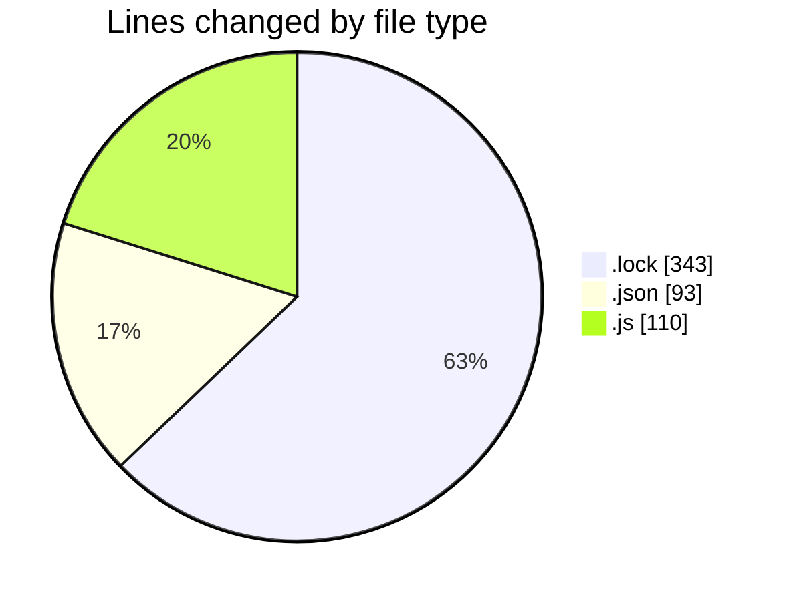
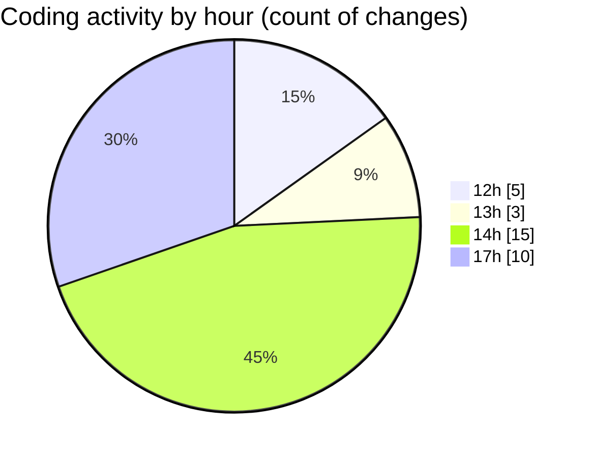

# cda - Activity Summary 

## Overall Statistics

| Stat                   | Value                                                             |
| ---------------------- | ----------------------------------------------------------------- |
| **Lines Added** (➕)   | 464                                          |
| **Lines Removed** (➖) | 82                                        |
| **Net Change** (↕)    | 382                |
| **Active Time** (⌚)   | 49 minutes |

## Modified Files
- **yarn.lock** (+266, -77)
- **tsconfig.json** (+23, -0)
- **20250130135205-create-duty-request-table.js** (+23, -1)
- **20250130140053-create-duty-request-status-history-table.js** (+27, -4)
- **settings.json** (+70, -0)
- **20241018145737-create-allocate-production-filter-to-person.js** (+18, -0)
- **20250130142220-create-duty-requests-view.js** (+37, -0)

## Visualizations

### By File Type (Lines Changed)

### By Hour (Estimated Activity Count)

> **Last Updated:** 30/01/2025, 17:18:27