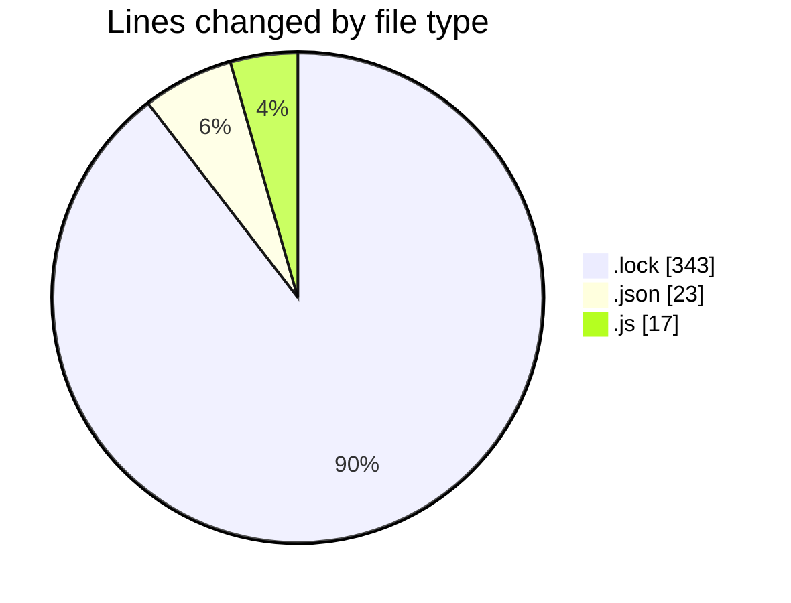
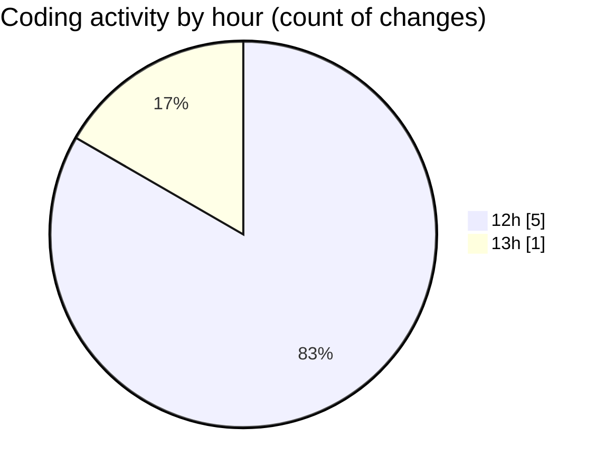

# cda - Activity Summary 

## Overall Statistics

| Stat                   | Value                                                             |
| ---------------------- | ----------------------------------------------------------------- |
| **Lines Added** (➕)   | 306                                          |
| **Lines Removed** (➖) | 77                                        |
| **Net Change** (↕)    | 229                |
| **Active Time** (⌚)   | 3 minutes |

## Modified Files
- **yarn.lock** (+266, -77)
- **tsconfig.json** (+23, -0)
- **20250130135205-create-duty-request-table.js** (+17, -0)

## Visualizations

### By File Type (Lines Changed)

### By Hour (Estimated Activity Count)

> **Last Updated:** 30/01/2025, 13:53:26