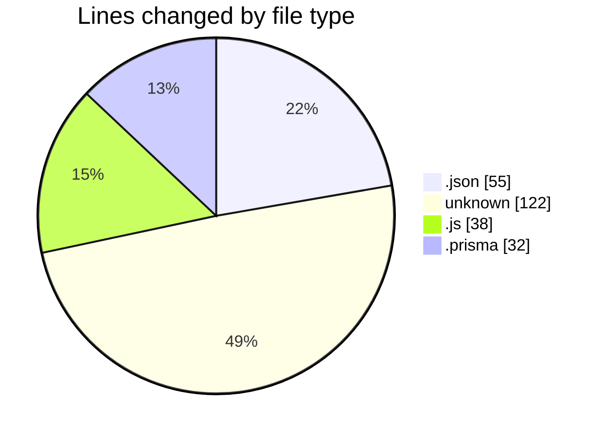
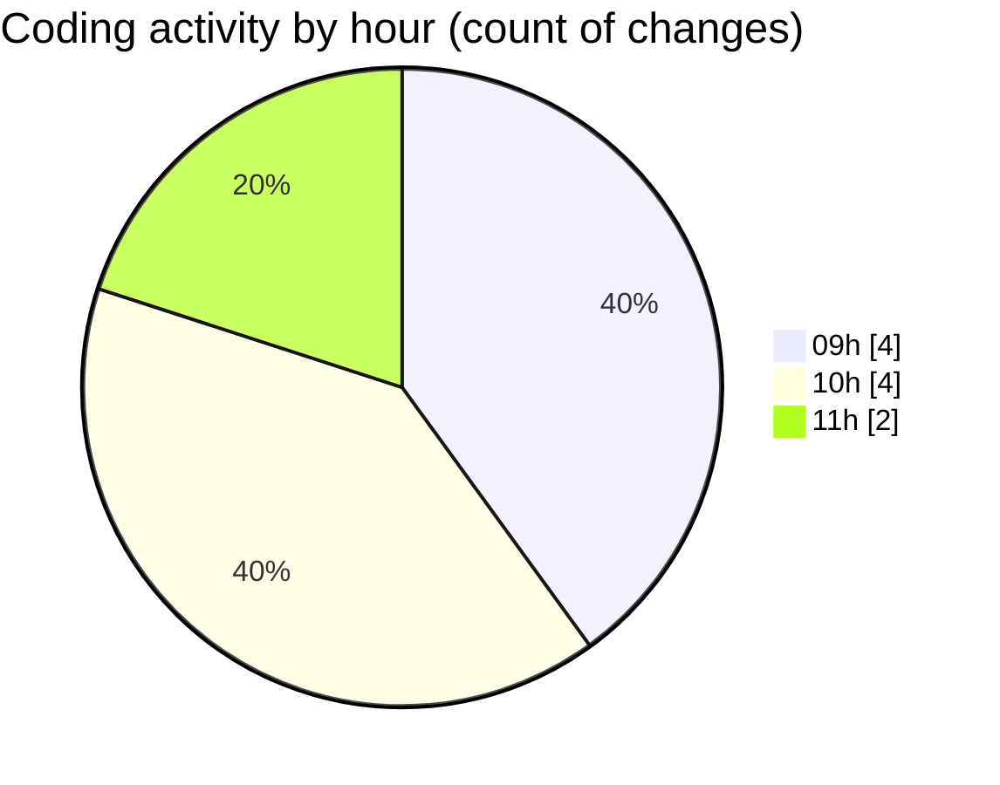

# good-pr - Activity Summary 

## Overall Statistics

| Stat                   | Value                                                             |
| ---------------------- | ----------------------------------------------------------------- |
| **Lines Added** (➕)   | 243                                          |
| **Lines Removed** (➖) | 4                                        |
| **Net Change** (↕)    | 239                |
| **Active Time** (⌚)   | 7 minutes |

## Modified Files
- **package.json** (+50, -0)
- **package.json** (+3, -2)
- **.env** (+74, -0)
- **github.js** (+36, -2)
- **Dockerfile** (+48, -0)
- **schema.prisma** (+32, -0)

## Visualizations

### By File Type (Lines Changed)

### By Hour (Estimated Activity Count)

> **Last Updated:** 30/01/2025, 11:27:08