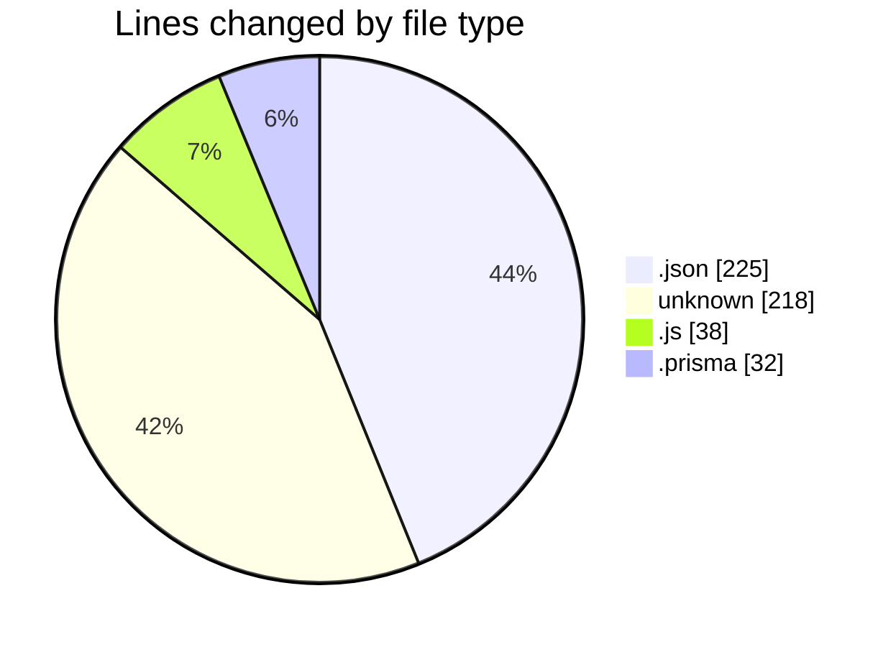
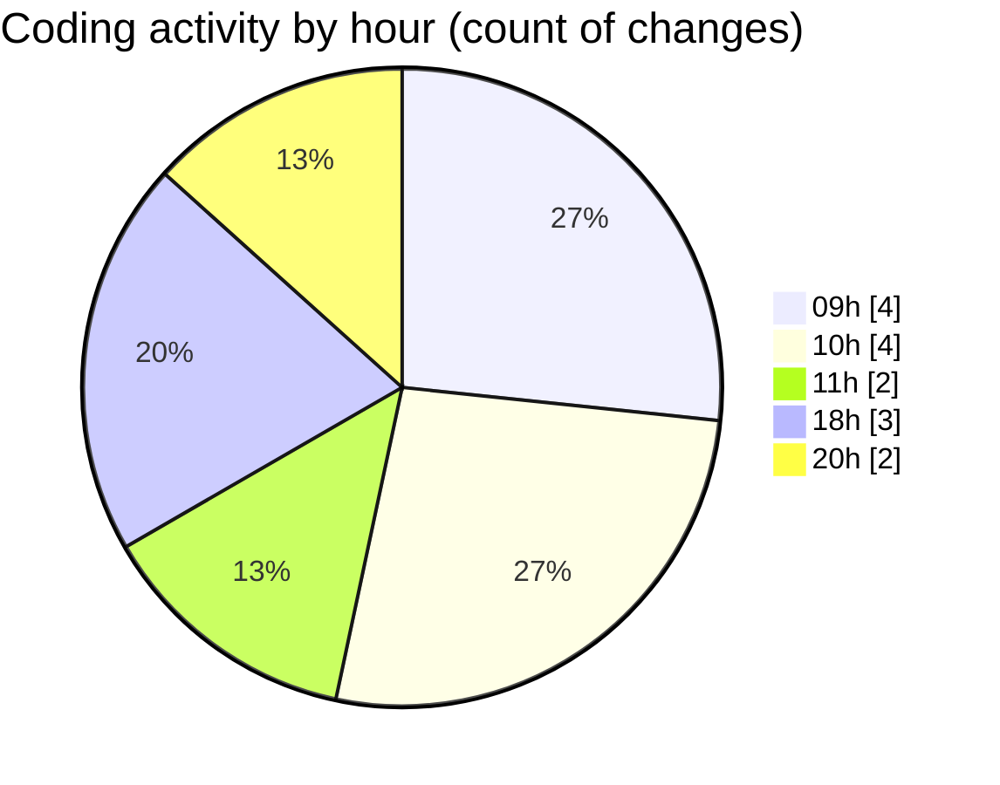

# good-pr - Activity Summary 

## Overall Statistics

| Stat                   | Value                                                             |
| ---------------------- | ----------------------------------------------------------------- |
| **Lines Added** (➕)   | 509                                          |
| **Lines Removed** (➖) | 4                                        |
| **Net Change** (↕)    | 505                |
| **Active Time** (⌚)   | 13 minutes |

## Modified Files
- **package.json** (+150, -0)
- **package.json** (+3, -2)
- **.env** (+74, -0)
- **github.js** (+36, -2)
- **Dockerfile** (+144, -0)
- **schema.prisma** (+32, -0)
- **settings.json** (+70, -0)

## Visualizations

### By File Type (Lines Changed)

### By Hour (Estimated Activity Count)

> **Last Updated:** 30/01/2025, 20:58:41