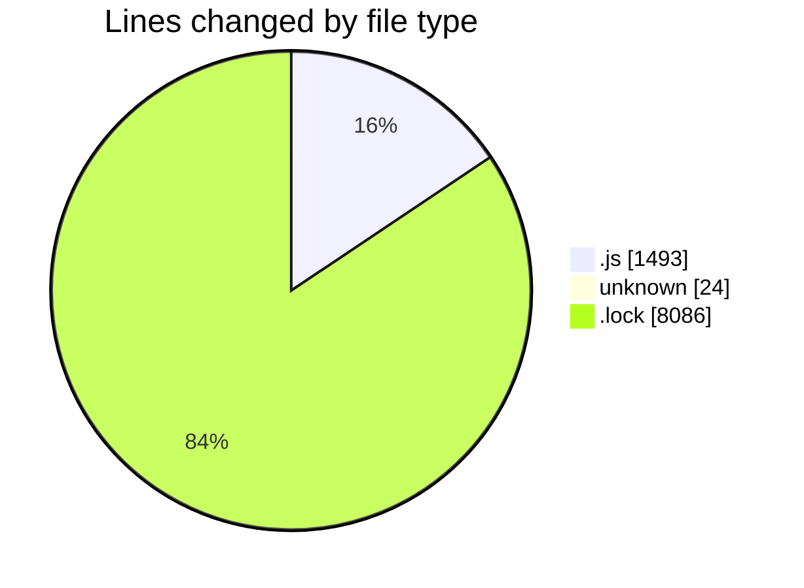
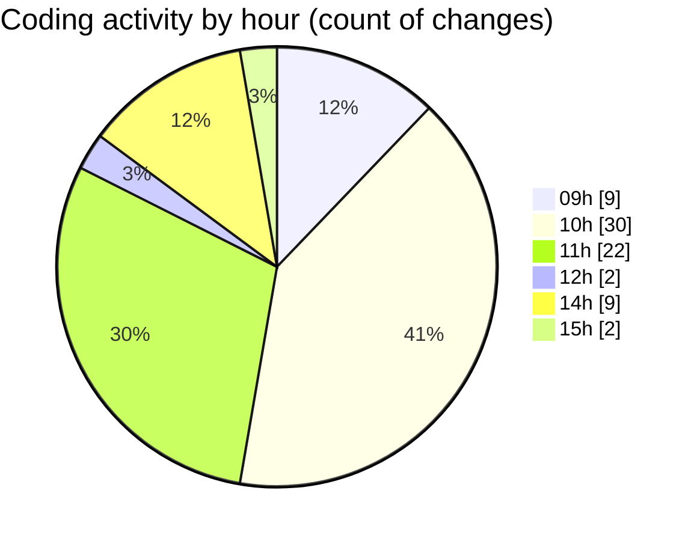

# cda - Activity Summary 

## Overall Statistics

| Stat                   | Value                                                             |
| ---------------------- | ----------------------------------------------------------------- |
| **Lines Added** (➕)   | 9122                                          |
| **Lines Removed** (➖) | 481                                        |
| **Net Change** (↕)    | 8641                |
| **Active Time** (⌚)   | 115 minutes |

## Modified Files
- **dutyRequest.js** (+440, -208)
- **duty-request.js** (+133, -5)
- **duty-request.js** (+86, -1)
- **.env** (+24, -0)
- **duty-reuqest.js** (+353, -267)
- **yarn.lock** (+8086, -0)

## Visualizations

### By File Type (Lines Changed)

### By Hour (Estimated Activity Count)

> **Last Updated:** 04/02/2025, 15:19:28