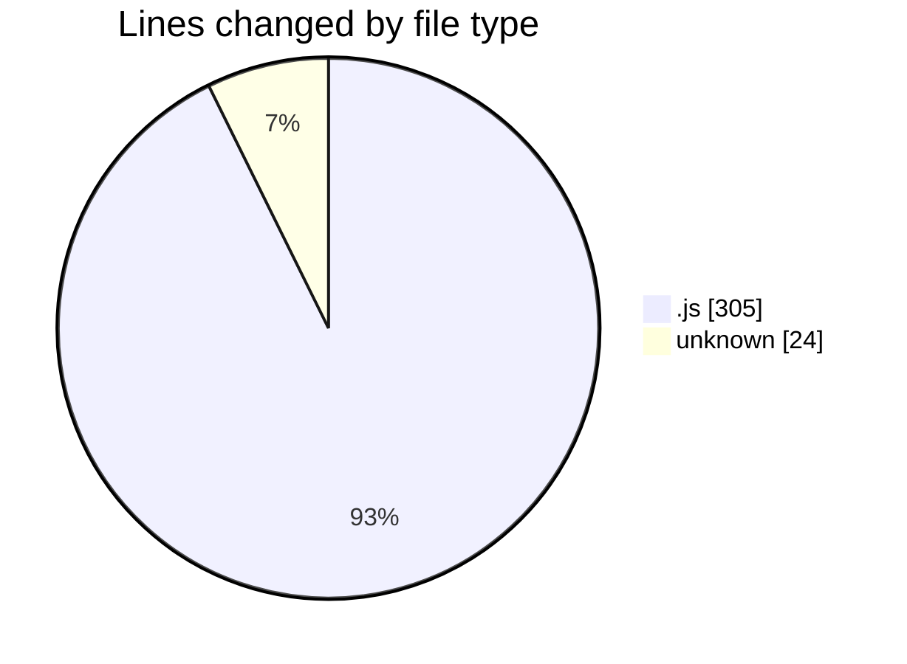
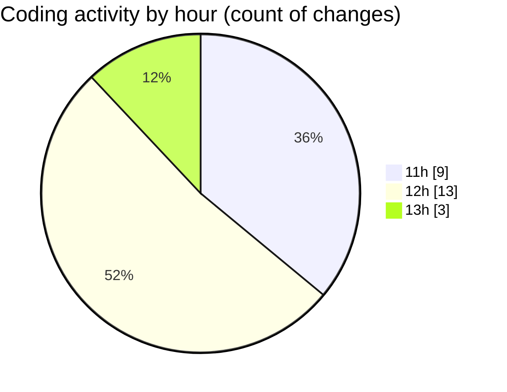

# cda - Activity Summary 

## Overall Statistics

| Stat                   | Value                                                             |
| ---------------------- | ----------------------------------------------------------------- |
| **Lines Added** (➕)   | 277                                          |
| **Lines Removed** (➖) | 52                                        |
| **Net Change** (↕)    | 225                |
| **Active Time** (⌚)   | 31 minutes |

## Modified Files
- **duty-reuqest.js** (+0, -42)
- **index.js** (+33, -3)
- **dutyRequest.js** (+2, -6)
- **index.js** (+30, -0)
- **duty-request.js** (+55, -1)
- **.env** (+24, -0)
- **duty-request.js** (+85, -0)
- **duty-request.js** (+48, -0)

## Visualizations

### By File Type (Lines Changed)

### By Hour (Estimated Activity Count)

> **Last Updated:** 05/02/2025, 13:04:29