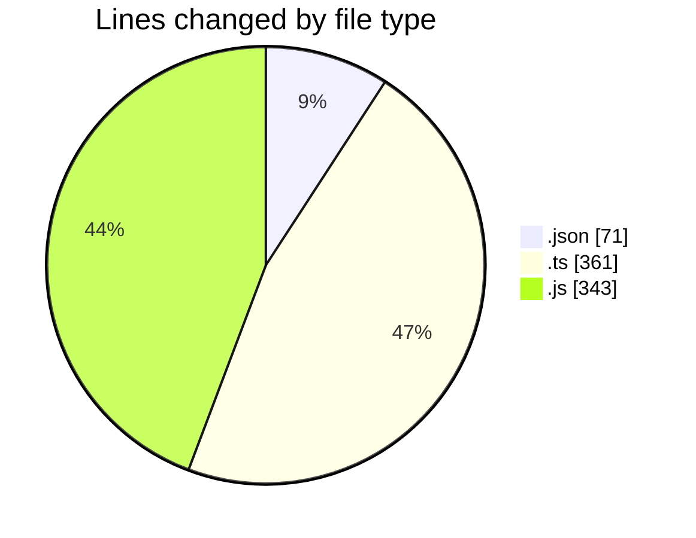
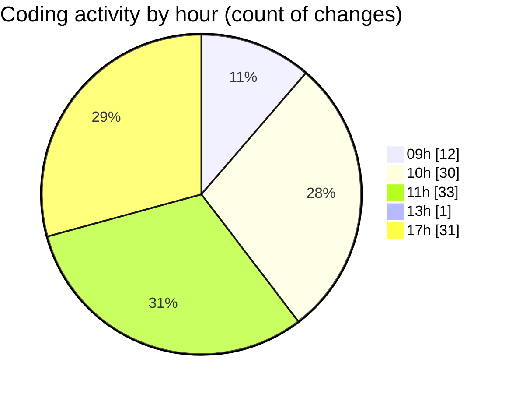

# cda - Activity Summary 

## Overall Statistics

| Stat                   | Value                                                             |
| ---------------------- | ----------------------------------------------------------------- |
| **Lines Added** (➕)   | 610                                          |
| **Lines Removed** (➖) | 165                                        |
| **Net Change** (↕)    | 445                |
| **Active Time** (⌚)   | 180 minutes |

## Modified Files
- **settings.json** (+71, -0)
- **createDutyRequest.ts** (+25, -21)
- **dutyRequest.js** (+8, -5)
- **deleteDutyRequest.ts** (+17, -18)
- **getDutyRequests.ts** (+141, -23)
- **updateDutyRequest.ts** (+107, -9)
- **duty-request.js** (+120, -68)
- **duty-request.js** (+121, -21)

## Visualizations

### By File Type (Lines Changed)

### By Hour (Estimated Activity Count)

> **Last Updated:** 06/02/2025, 17:56:27