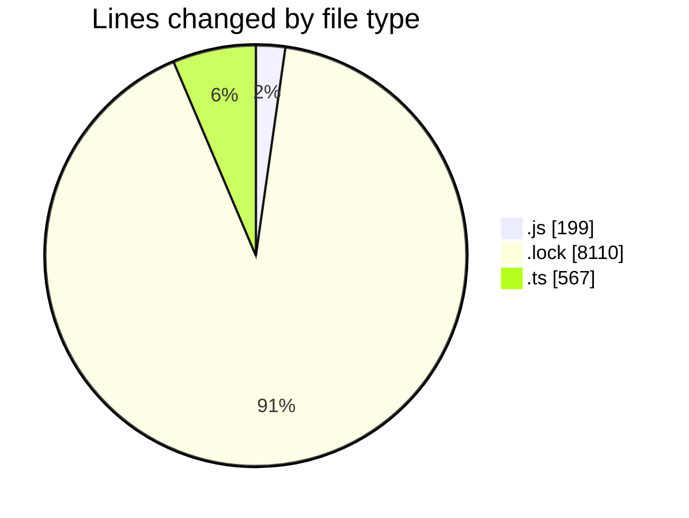
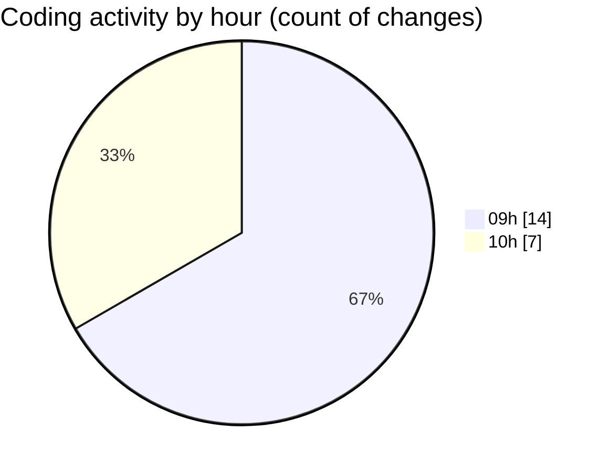

# cda - Activity Summary 

## Overall Statistics

| Stat                   | Value                                                             |
| ---------------------- | ----------------------------------------------------------------- |
| **Lines Added** (➕)   | 8844                                          |
| **Lines Removed** (➖) | 32                                        |
| **Net Change** (↕)    | 8812                |
| **Active Time** (⌚)   | 26 minutes |

## Modified Files
- **duty-request.js** (+55, -15)
- **duty-request.js** (+95, -4)
- **yarn.lock** (+8098, -12)
- **index.js** (+30, -0)
- **index.ts** (+273, -0)
- **createDutyRequest.ts** (+76, -0)
- **getDutyRequests.ts** (+118, -0)
- **updateDutyRequest.ts** (+99, -1)

## Visualizations

### By File Type (Lines Changed)

### By Hour (Estimated Activity Count)

> **Last Updated:** 07/02/2025, 10:52:10