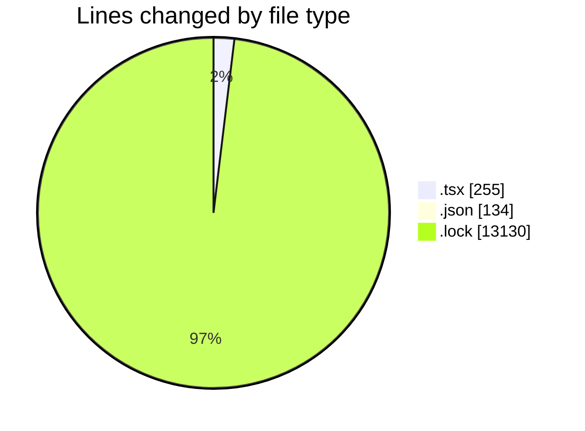
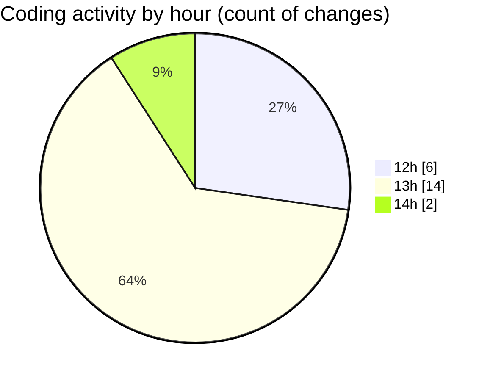

# cda - Activity Summary 

## Overall Statistics

| Stat                   | Value                                                             |
| ---------------------- | ----------------------------------------------------------------- |
| **Lines Added** (➕)   | 13479                                          |
| **Lines Removed** (➖) | 40                                        |
| **Net Change** (↕)    | 13439                |
| **Active Time** (⌚)   | 28 minutes |

## Modified Files
- **Home.tsx** (+60, -0)
- **RequestWrapper.tsx** (+114, -39)
- **App.tsx** (+42, -0)
- **package.json** (+62, -1)
- **yarn.lock** (+13130, -0)
- **settings.json** (+71, -0)

## Visualizations

### By File Type (Lines Changed)

### By Hour (Estimated Activity Count)

> **Last Updated:** 09/02/2025, 14:02:25