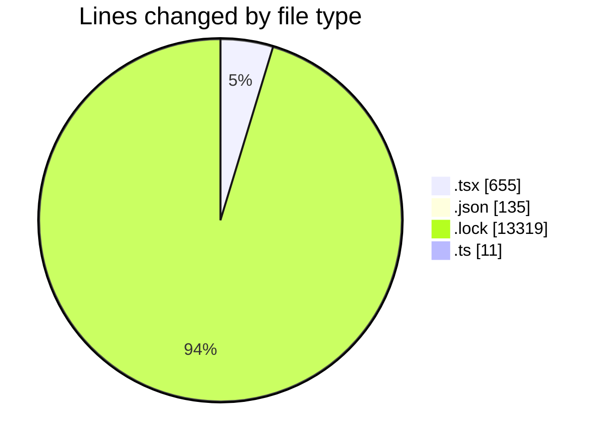
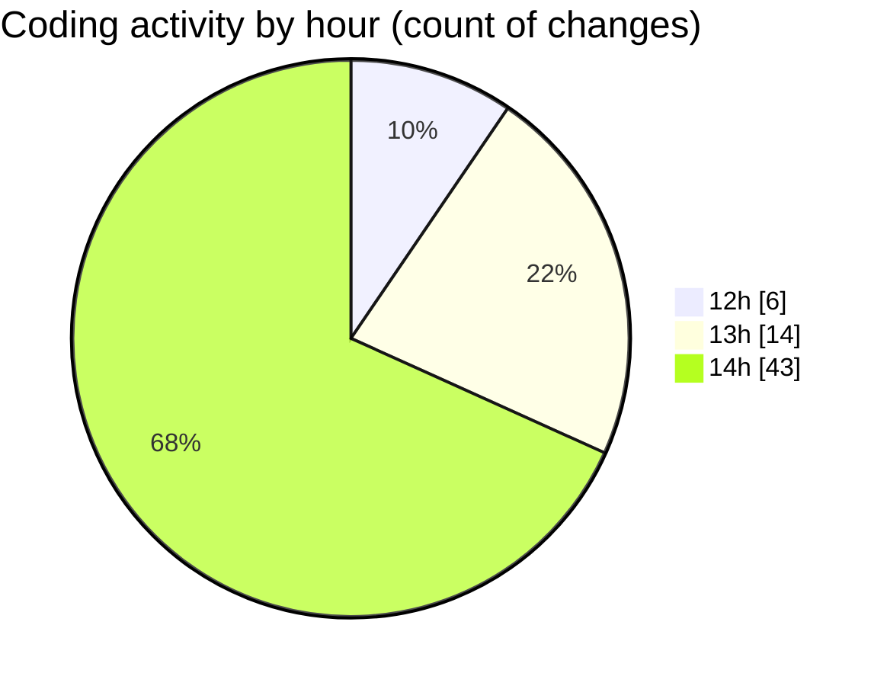

# cda - Activity Summary 

## Overall Statistics

| Stat                   | Value                                                             |
| ---------------------- | ----------------------------------------------------------------- |
| **Lines Added** (➕)   | 13899                                          |
| **Lines Removed** (➖) | 221                                        |
| **Net Change** (↕)    | 13678                |
| **Active Time** (⌚)   | 83 minutes |

## Modified Files
- **Home.tsx** (+62, -4)
- **RequestWrapper.tsx** (+305, -216)
- **App.tsx** (+47, -0)
- **package.json** (+63, -1)
- **yarn.lock** (+13130, -0)
- **settings.json** (+71, -0)
- **version.ts** (+11, -0)
- **yarn.lock** (+189, -0)
- **NewRequest.tsx** (+21, -0)

## Visualizations

### By File Type (Lines Changed)

### By Hour (Estimated Activity Count)

> **Last Updated:** 09/02/2025, 14:47:25