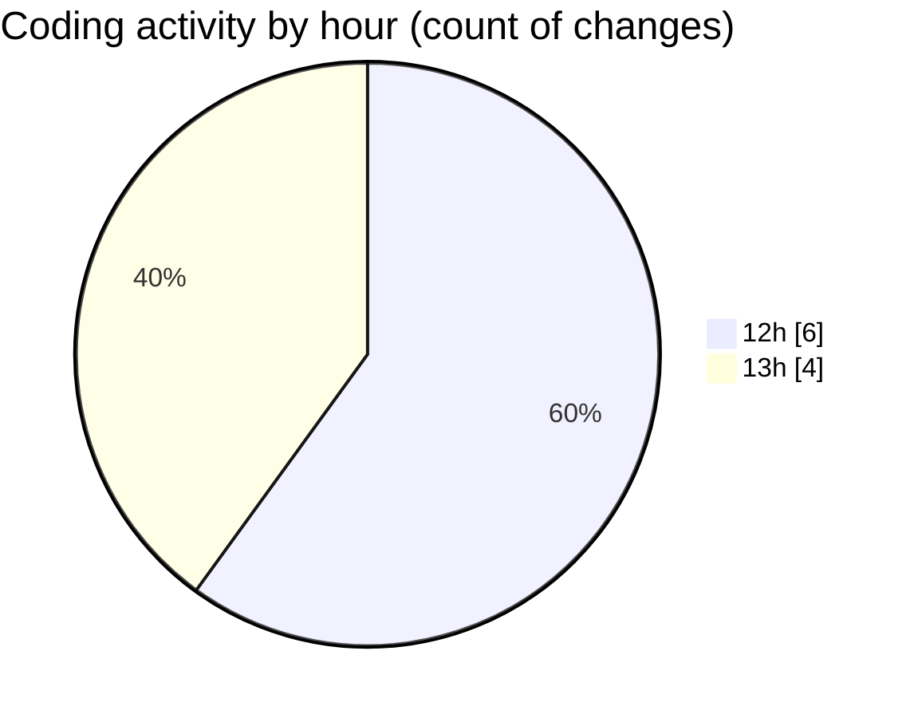

# cda - Activity Summary 

## Overall Statistics

| Stat                   | Value                                                             |
| ---------------------- | ----------------------------------------------------------------- |
| **Lines Added** (➕)   | 13325                                          |
| **Lines Removed** (➖) | 16                                        |
| **Net Change** (↕)    | 13309                |
| **Active Time** (⌚)   | 8 minutes |

## Modified Files
- **Home.tsx** (+38, -0)
- **RequestWrapper.tsx** (+67, -15)
- **App.tsx** (+42, -0)
- **package.json** (+60, -1)
- **yarn.lock** (+13118, -0)

## Visualizations

### By File Type (Lines Changed)

### By Hour (Estimated Activity Count)

> **Last Updated:** 09/02/2025, 13:22:25