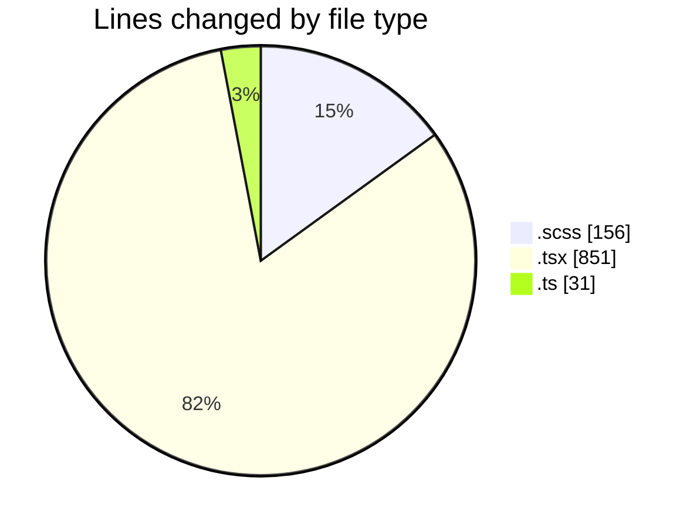
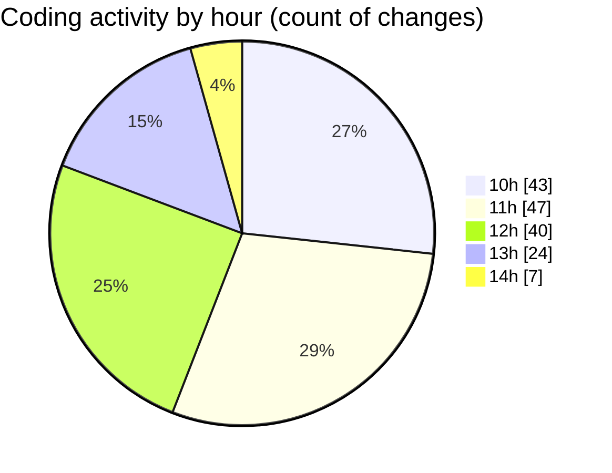

# cda - Activity Summary 

## Overall Statistics

| Stat                   | Value                                                             |
| ---------------------- | ----------------------------------------------------------------- |
| **Lines Added** (➕)   | 724                                          |
| **Lines Removed** (➖) | 314                                        |
| **Net Change** (↕)    | 410                |
| **Active Time** (⌚)   | 259 minutes |

## Modified Files
- **RequestWrapper.scss** (+16, -6)
- **RequestForm.tsx** (+562, -270)
- **types.ts** (+26, -5)
- **Home.tsx** (+0, -16)
- **NewRequest.tsx** (+0, -3)
- **RequestForm.scss** (+120, -14)

## Visualizations

### By File Type (Lines Changed)

### By Hour (Estimated Activity Count)

> **Last Updated:** 10/02/2025, 14:28:34