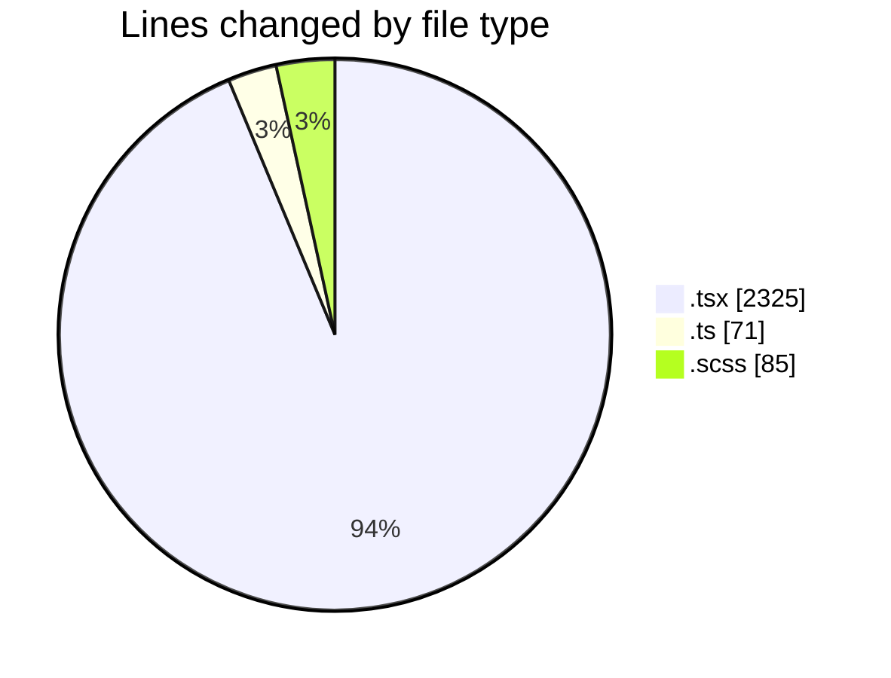
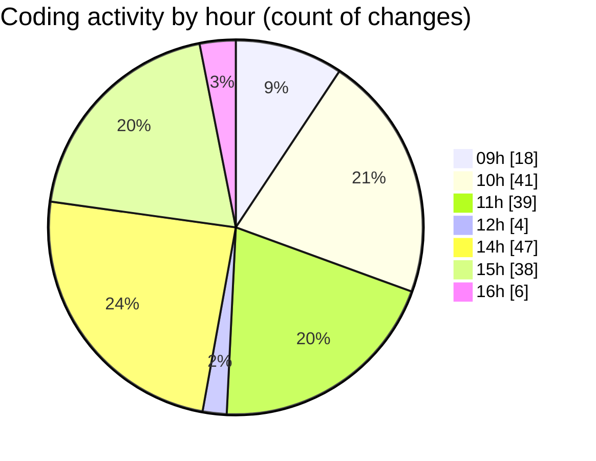

# cda - Activity Summary 

## Overall Statistics

| Stat                   | Value                                                             |
| ---------------------- | ----------------------------------------------------------------- |
| **Lines Added** (➕)   | 1439                                          |
| **Lines Removed** (➖) | 1042                                        |
| **Net Change** (↕)    | 397                |
| **Active Time** (⌚)   | 301 minutes |

## Modified Files
- **RequestForm.tsx** (+1288, -1026)
- **types.ts** (+44, -16)
- **GenerateOptions.ts** (+11, -0)
- **GenerateOptions.tsx** (+11, -0)
- **RequestForm.scss** (+85, -0)

## Visualizations

### By File Type (Lines Changed)

### By Hour (Estimated Activity Count)

> **Last Updated:** 11/02/2025, 16:13:48