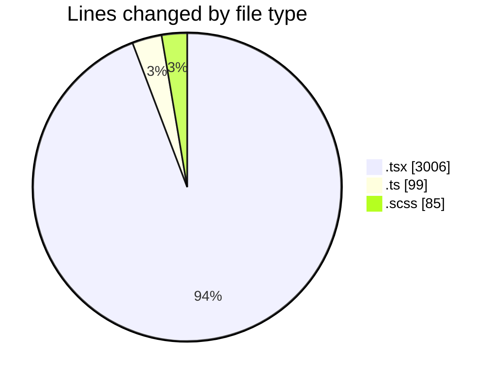
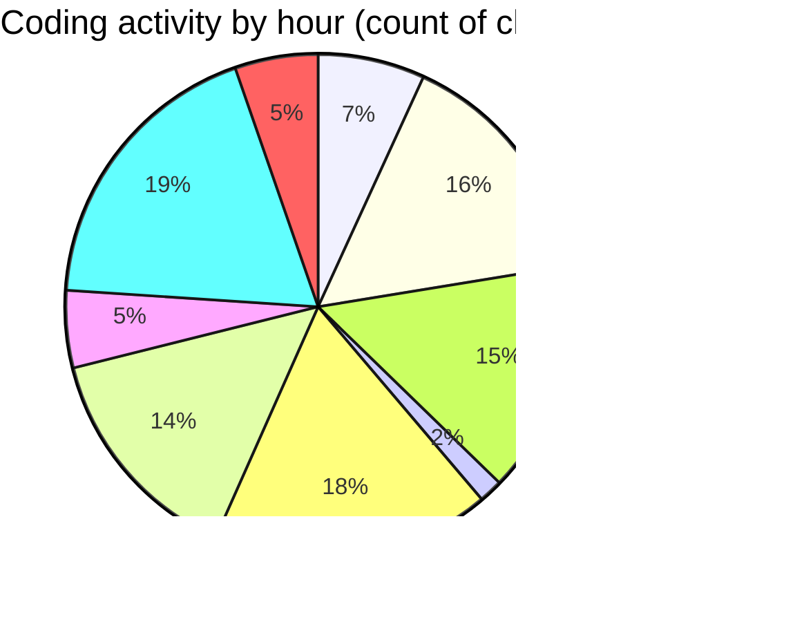

# cda - Activity Summary 

## Overall Statistics

| Stat                   | Value                                                             |
| ---------------------- | ----------------------------------------------------------------- |
| **Lines Added** (➕)   | 1913                                          |
| **Lines Removed** (➖) | 1277                                        |
| **Net Change** (↕)    | 636                |
| **Active Time** (⌚)   | 401 minutes |

## Modified Files
- **RequestForm.tsx** (+1734, -1261)
- **types.ts** (+72, -16)
- **GenerateOptions.ts** (+11, -0)
- **GenerateOptions.tsx** (+11, -0)
- **RequestForm.scss** (+85, -0)

## Visualizations

### By File Type (Lines Changed)

### By Hour (Estimated Activity Count)

> **Last Updated:** 11/02/2025, 18:18:14