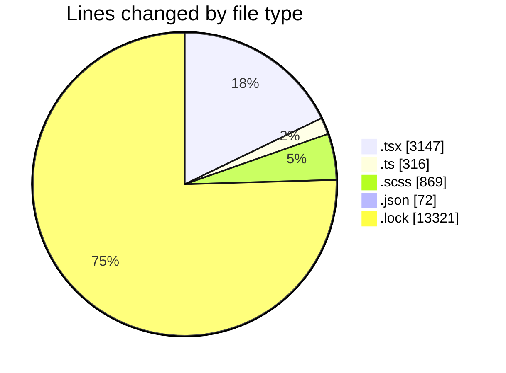
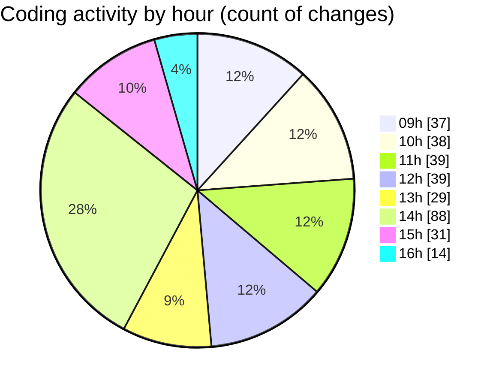

# cda - Activity Summary 

## Overall Statistics

| Stat                   | Value                                                             |
| ---------------------- | ----------------------------------------------------------------- |
| **Lines Added** (➕)   | 16041                                          |
| **Lines Removed** (➖) | 1684                                        |
| **Net Change** (↕)    | 14357                |
| **Active Time** (⌚)   | 489 minutes |

## Modified Files
- **RequestForm.tsx** (+1005, -859)
- **Home.tsx** (+42, -9)
- **TimeInputs.tsx** (+441, -245)
- **index.ts** (+3, -0)
- **types.ts** (+28, -2)
- **RequestForm.scss** (+474, -305)
- **NewRequest.tsx** (+53, -30)
- **App.scss** (+42, -10)
- **TimeInputs.scss** (+23, -9)
- **NewRequest.scss** (+6, -0)
- **TimeInputs.test.tsx** (+141, -27)
- **index.d.ts** (+283, -0)
- **package.json** (+10, -0)
- **yarn.lock** (+13228, -93)
- **RequestForm.test.tsx** (+149, -71)
- **package.json** (+62, -0)
- **Home.test.tsx** (+25, -12)
- **RequestContent.test.tsx** (+13, -12)
- **RequestWrapper.test.tsx** (+13, -0)

## Visualizations

### By File Type (Lines Changed)

### By Hour (Estimated Activity Count)

> **Last Updated:** 12/02/2025, 16:31:22