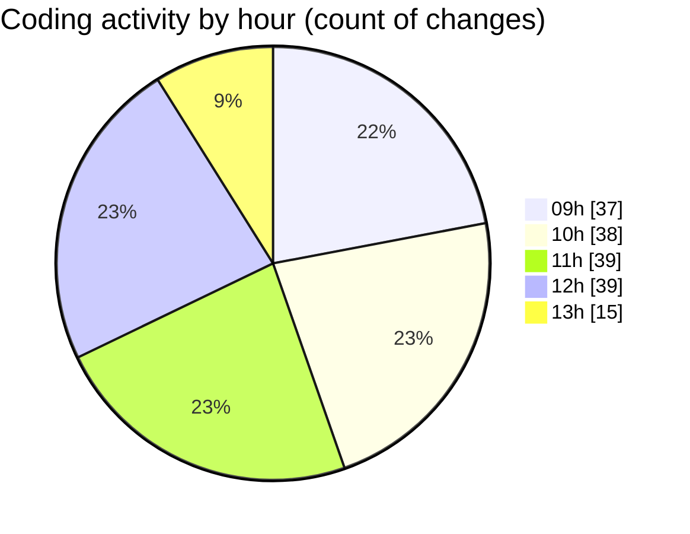

# cda - Activity Summary 

## Overall Statistics

| Stat                   | Value                                                             |
| ---------------------- | ----------------------------------------------------------------- |
| **Lines Added** (➕)   | 1555                                          |
| **Lines Removed** (➖) | 1140                                        |
| **Net Change** (↕)    | 415                |
| **Active Time** (⌚)   | 286 minutes |

## Modified Files
- **RequestForm.tsx** (+1005, -857)
- **Home.tsx** (+42, -9)
- **TimeInputs.tsx** (+340, -245)
- **index.ts** (+3, -0)
- **types.ts** (+28, -2)
- **RequestForm.scss** (+85, -0)
- **NewRequest.tsx** (+52, -27)

## Visualizations

### By File Type (Lines Changed)

### By Hour (Estimated Activity Count)

> **Last Updated:** 12/02/2025, 13:31:52