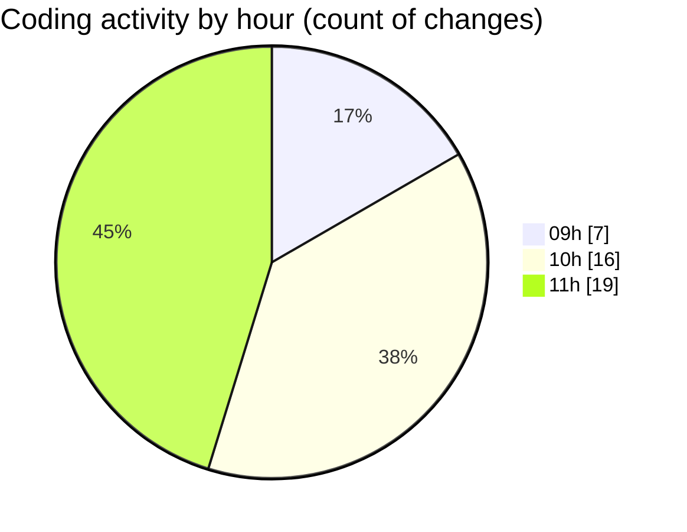

# cda - Activity Summary 

## Overall Statistics

| Stat                   | Value                                                             |
| ---------------------- | ----------------------------------------------------------------- |
| **Lines Added** (➕)   | 439                                          |
| **Lines Removed** (➖) | 43                                        |
| **Net Change** (↕)    | 396                |
| **Active Time** (⌚)   | 63 minutes |

## Modified Files
- **RequestForm.test.tsx** (+64, -0)
- **Home.test.tsx** (+38, -0)
- **App.tsx** (+47, -0)
- **Home.tsx** (+60, -17)
- **Home.scss** (+26, -0)
- **.gitignore** (+2, -0)
- **NewRequest.scss** (+6, -5)
- **NewRequest.tsx** (+25, -2)
- **RequestForm.tsx** (+171, -19)

## Visualizations

### By File Type (Lines Changed)

### By Hour (Estimated Activity Count)

> **Last Updated:** 13/02/2025, 11:45:02