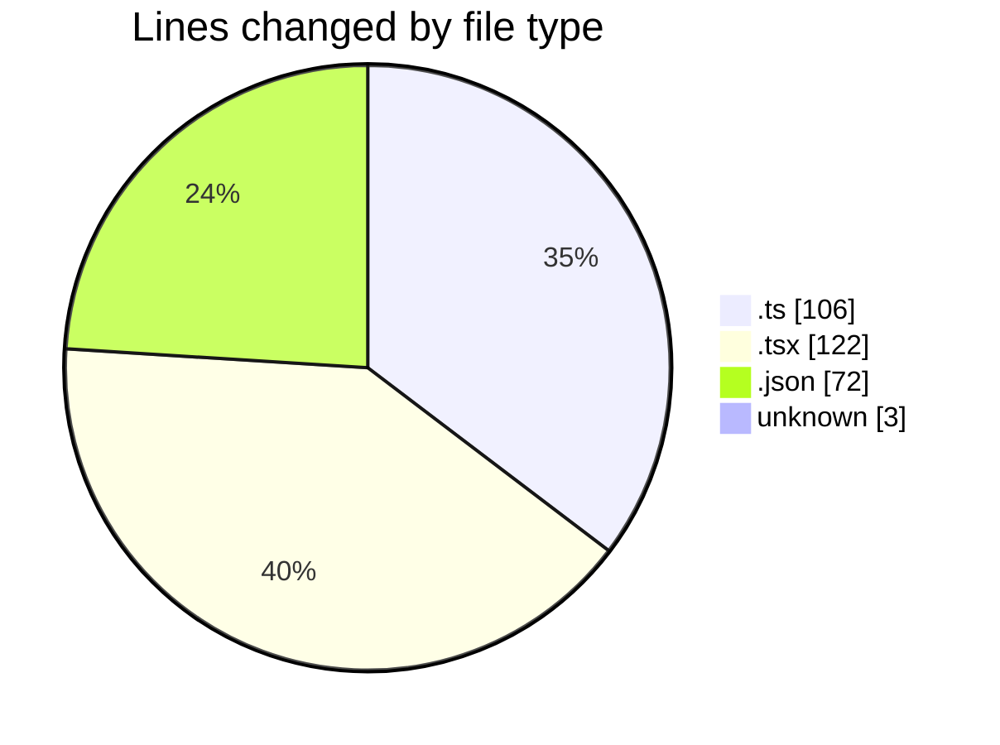
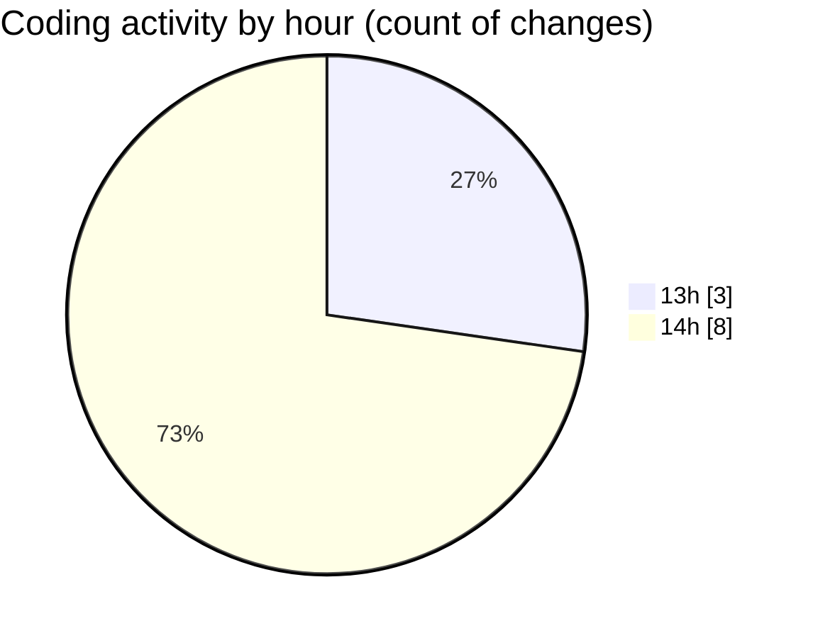

# pdf-analysis-app - Activity Summary 

## Overall Statistics

| Stat                   | Value                                                             |
| ---------------------- | ----------------------------------------------------------------- |
| **Lines Added** (➕)   | 284                                          |
| **Lines Removed** (➖) | 19                                        |
| **Net Change** (↕)    | 265                |
| **Active Time** (⌚)   | 11 minutes |

## Modified Files
- **api.ts** (+84, -9)
- **socket.ts** (+13, -0)
- **Home.tsx** (+114, -8)
- **settings.json** (+71, -1)
- **.env** (+2, -1)

## Visualizations

### By File Type (Lines Changed)

### By Hour (Estimated Activity Count)

> **Last Updated:** 13/02/2025, 14:34:38