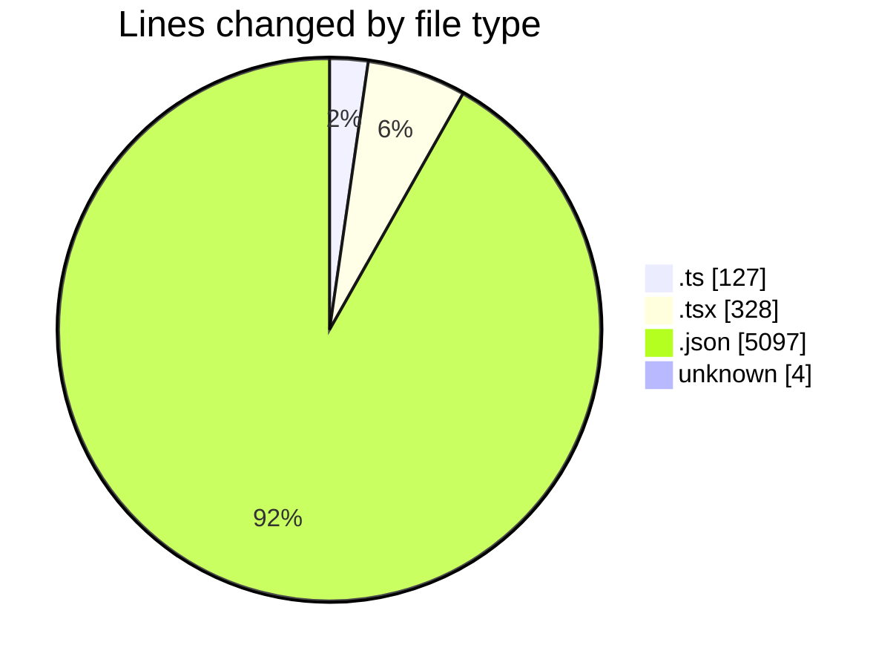
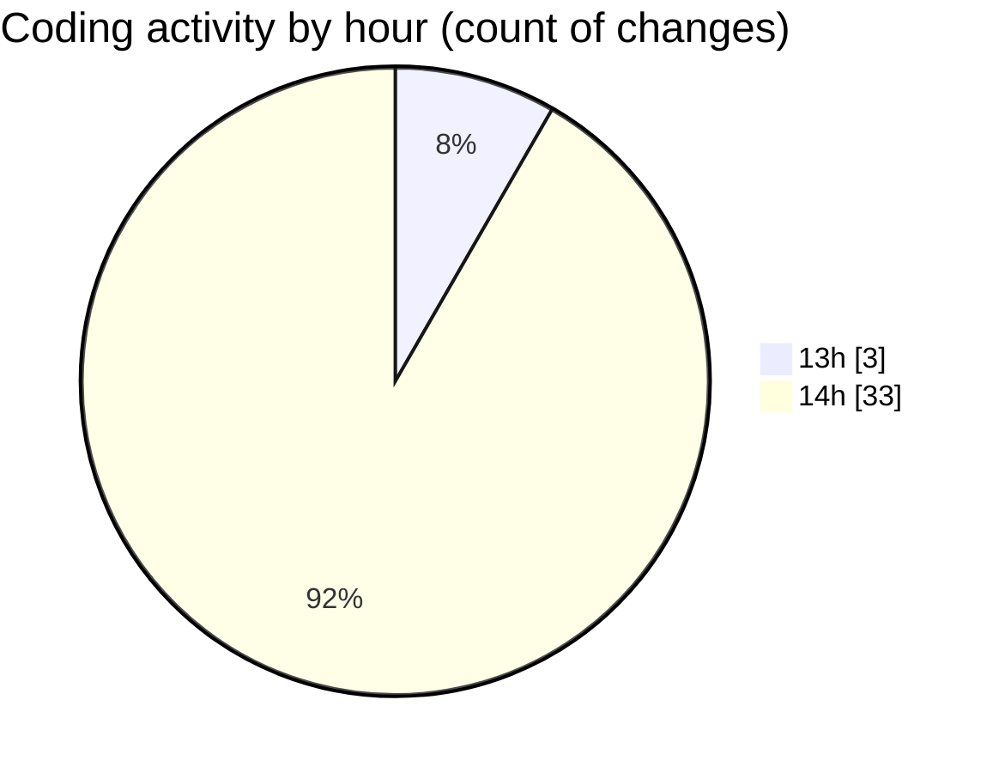

# pdf-analysis-app - Activity Summary 

## Overall Statistics

| Stat                   | Value                                                             |
| ---------------------- | ----------------------------------------------------------------- |
| **Lines Added** (➕)   | 5521                                          |
| **Lines Removed** (➖) | 35                                        |
| **Net Change** (↕)    | 5486                |
| **Active Time** (⌚)   | 42 minutes |

## Modified Files
- **api.ts** (+84, -9)
- **socket.ts** (+17, -6)
- **Home.tsx** (+236, -8)
- **settings.json** (+142, -1)
- **.env** (+3, -1)
- **package.json** (+90, -0)
- **socketUrl.ts** (+9, -2)
- **App.tsx** (+48, -8)
- **Landing.tsx** (+28, -0)
- **package-lock.json** (+4864, -0)

## Visualizations

### By File Type (Lines Changed)

### By Hour (Estimated Activity Count)

> **Last Updated:** 13/02/2025, 14:51:26