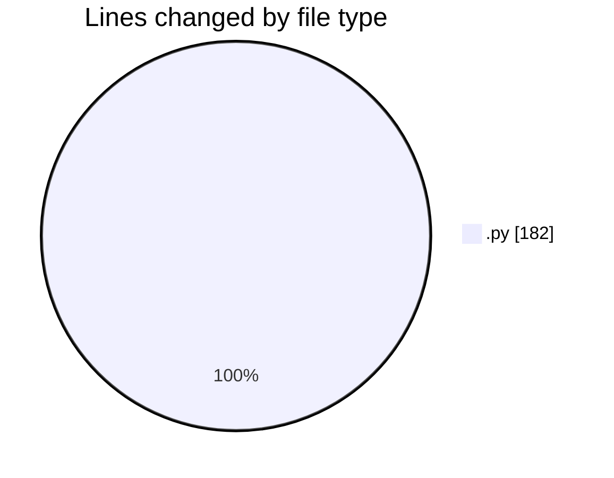

# samplePdf - Activity Summary 

## Overall Statistics

| Stat                   | Value                                                             |
| ---------------------- | ----------------------------------------------------------------- |
| **Lines Added** (➕)   | 179                                          |
| **Lines Removed** (➖) | 3                                        |
| **Net Change** (↕)    | 176                |
| **Active Time** (⌚)   | 3 minutes |

## Modified Files
- **app.py** (+87, -0)
- **pdf_processing.py** (+42, -0)
- **calcGrandTotals.py** (+50, -3)

## Visualizations

### By File Type (Lines Changed)

### By Hour (Estimated Activity Count)

> **Last Updated:** 13/02/2025, 13:56:30