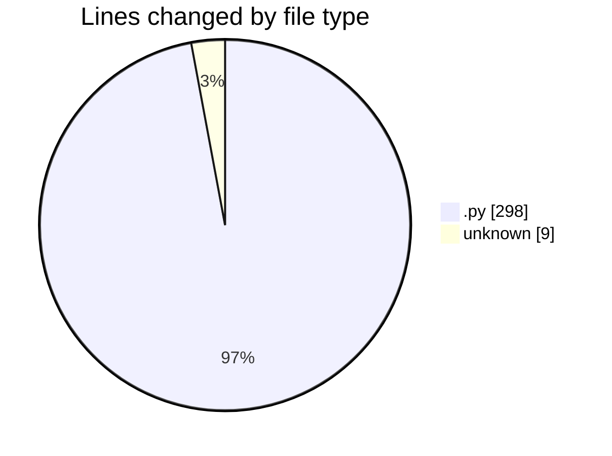
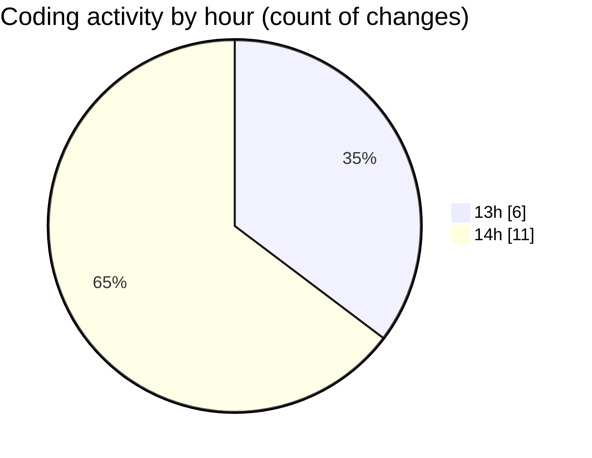

# samplePdf - Activity Summary 

## Overall Statistics

| Stat                   | Value                                                             |
| ---------------------- | ----------------------------------------------------------------- |
| **Lines Added** (➕)   | 301                                          |
| **Lines Removed** (➖) | 6                                        |
| **Net Change** (↕)    | 295                |
| **Active Time** (⌚)   | 22 minutes |

## Modified Files
- **app.py** (+87, -0)
- **pdf_processing.py** (+42, -0)
- **calcGrandTotals.py** (+53, -3)
- **extractSiteNames.py** (+73, -0)
- **cors_config.py** (+14, -0)
- **config.py** (+23, -3)
- **.env** (+9, -0)

## Visualizations

### By File Type (Lines Changed)

### By Hour (Estimated Activity Count)

> **Last Updated:** 13/02/2025, 14:21:30