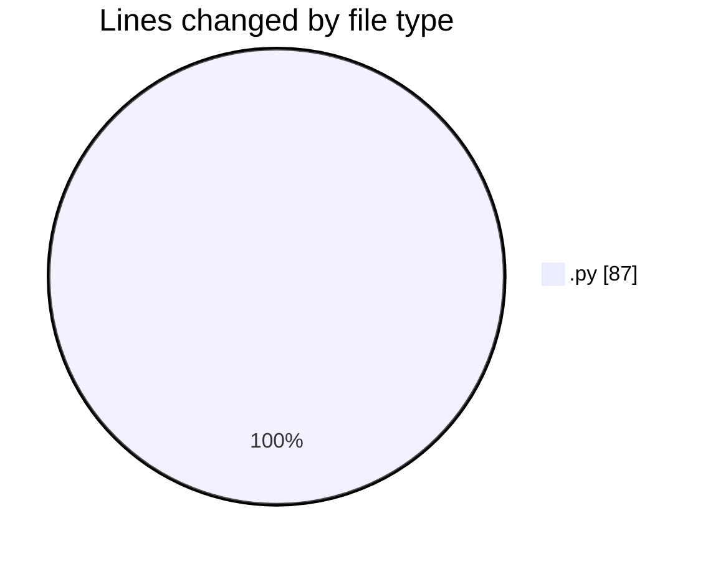

# samplePdf - Activity Summary 

## Overall Statistics

| Stat                   | Value                                                             |
| ---------------------- | ----------------------------------------------------------------- |
| **Lines Added** (➕)   | 87                                          |
| **Lines Removed** (➖) | 0                                        |
| **Net Change** (↕)    | 87                |
| **Active Time** (⌚)   | 0 minute |

## Modified Files
- **app.py** (+87, -0)

## Visualizations

### By File Type (Lines Changed)

### By Hour (Estimated Activity Count)

> **Last Updated:** 13/02/2025, 13:26:30