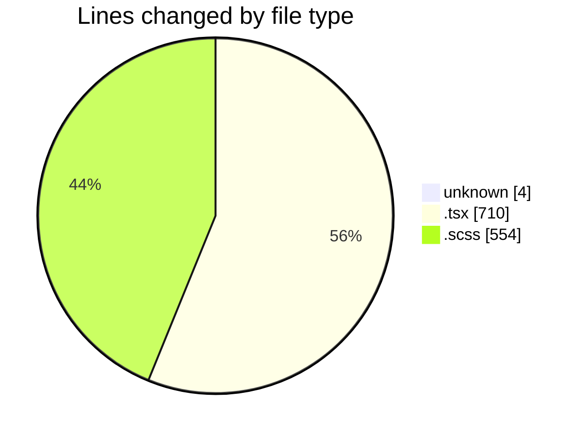
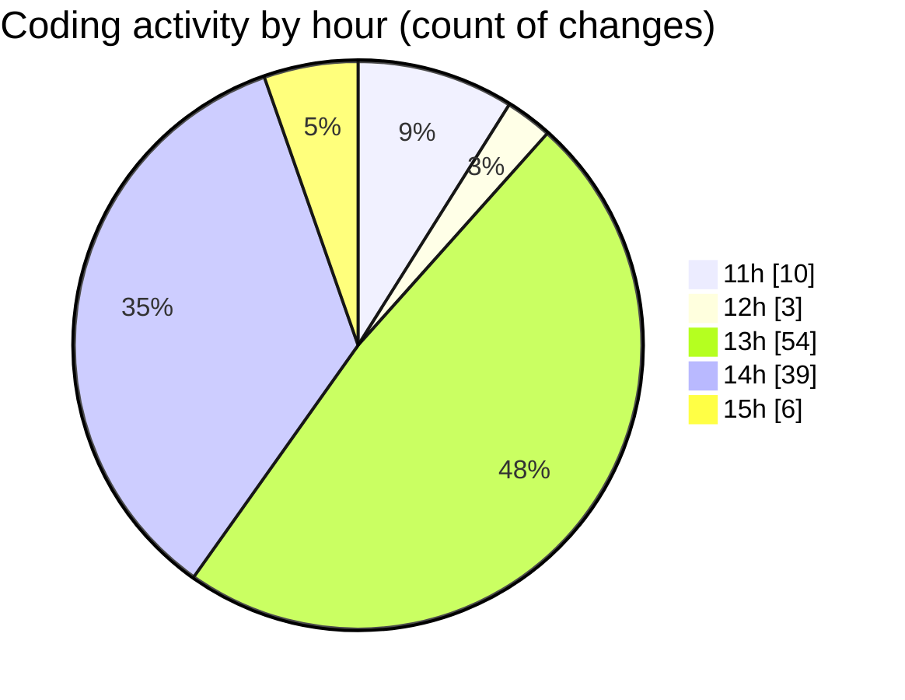

# cda - Activity Summary 

## Overall Statistics

| Stat                   | Value                                                             |
| ---------------------- | ----------------------------------------------------------------- |
| **Lines Added** (➕)   | 805                                          |
| **Lines Removed** (➖) | 463                                        |
| **Net Change** (↕)    | 342                |
| **Active Time** (⌚)   | 157 minutes |

## Modified Files
- **.gitignore** (+3, -1)
- **RequestWrapper.tsx** (+237, -167)
- **RequestWrapper.scss** (+237, -200)
- **RequestCard.tsx** (+145, -20)
- **RequestCard.scss** (+82, -35)
- **RequestCard.test.tsx** (+43, -0)
- **RequestWrapper.test.tsx** (+58, -40)

## Visualizations

### By File Type (Lines Changed)

### By Hour (Estimated Activity Count)

> **Last Updated:** 14/02/2025, 15:04:56