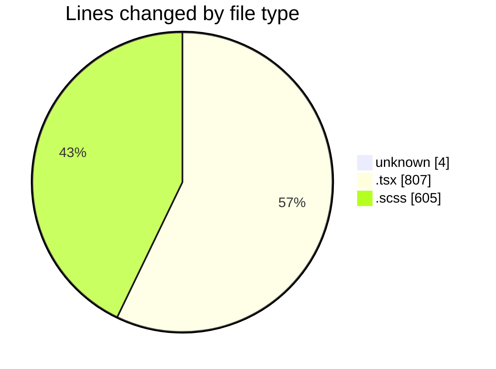
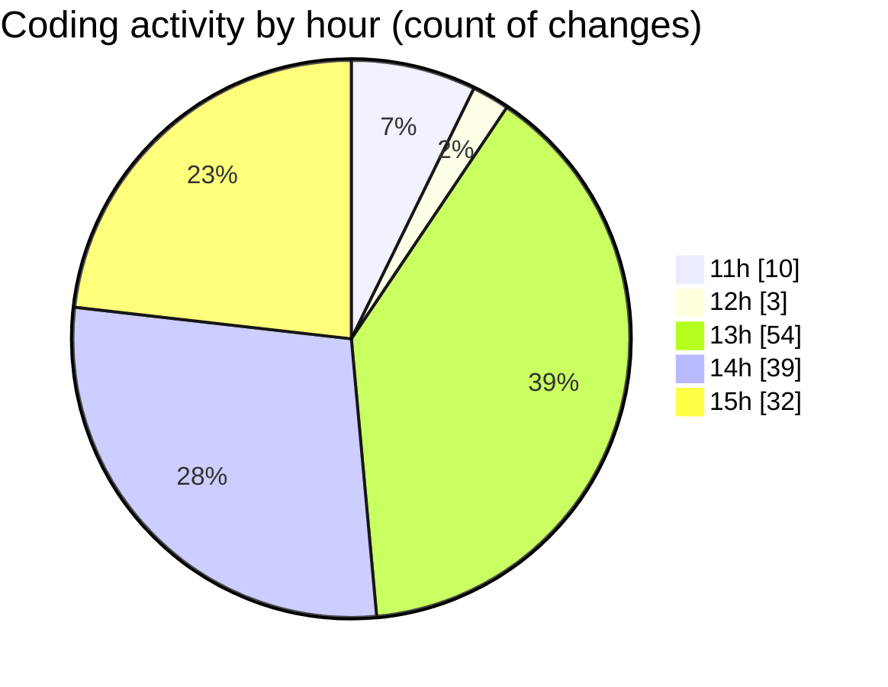

# cda - Activity Summary 

## Overall Statistics

| Stat                   | Value                                                             |
| ---------------------- | ----------------------------------------------------------------- |
| **Lines Added** (➕)   | 866                                          |
| **Lines Removed** (➖) | 550                                        |
| **Net Change** (↕)    | 316                |
| **Active Time** (⌚)   | 189 minutes |

## Modified Files
- **.gitignore** (+3, -1)
- **RequestWrapper.tsx** (+237, -167)
- **RequestWrapper.scss** (+237, -200)
- **RequestCard.tsx** (+157, -78)
- **RequestCard.scss** (+104, -64)
- **RequestCard.test.tsx** (+43, -0)
- **RequestWrapper.test.tsx** (+58, -40)
- **RequestContent.tsx** (+27, -0)

## Visualizations

### By File Type (Lines Changed)

### By Hour (Estimated Activity Count)

> **Last Updated:** 14/02/2025, 15:49:56