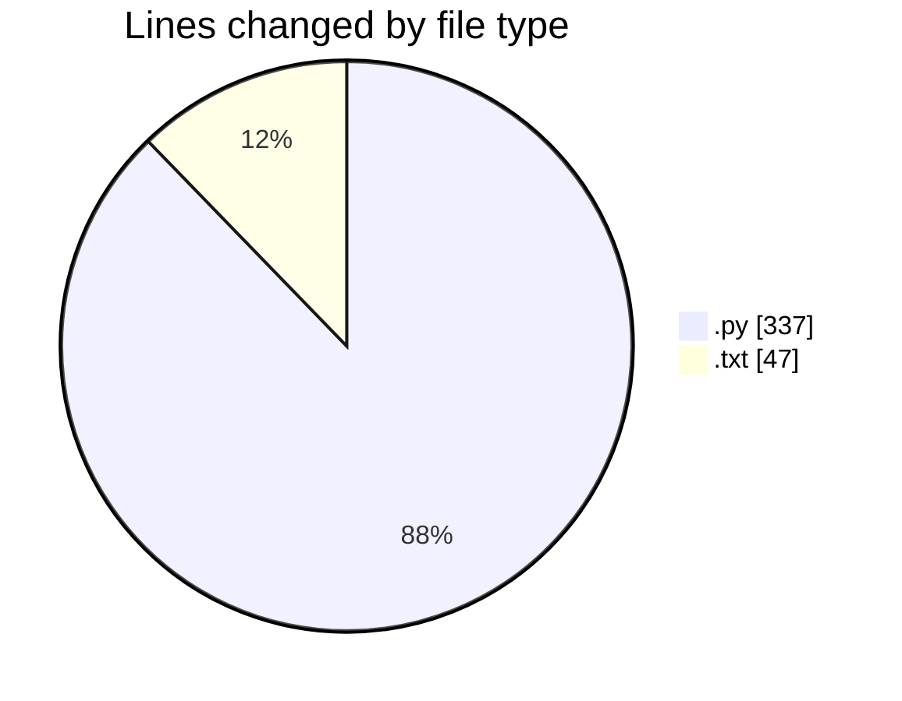
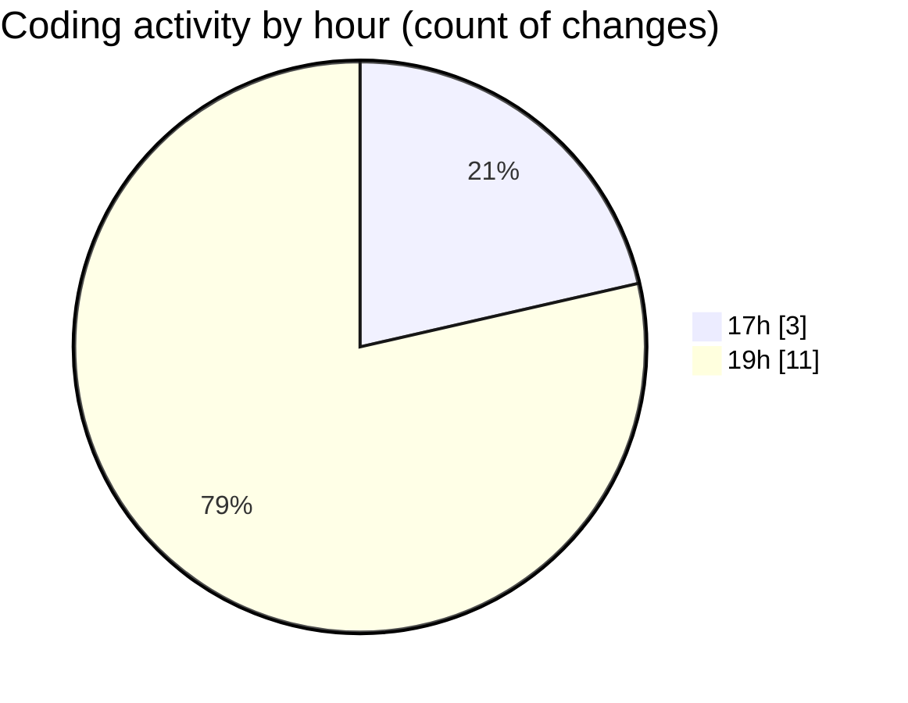

# samplePdf - Activity Summary 

## Overall Statistics

| Stat                   | Value                                                             |
| ---------------------- | ----------------------------------------------------------------- |
| **Lines Added** (➕)   | 334                                          |
| **Lines Removed** (➖) | 50                                        |
| **Net Change** (↕)    | 284                |
| **Active Time** (⌚)   | 18 minutes |

## Modified Files
- **app.py** (+90, -0)
- **requirements.txt** (+44, -3)
- **file_upload.py** (+149, -47)
- **calcSiteTotals.py** (+51, -0)

## Visualizations

### By File Type (Lines Changed)

### By Hour (Estimated Activity Count)

> **Last Updated:** 19/02/2025, 19:44:59