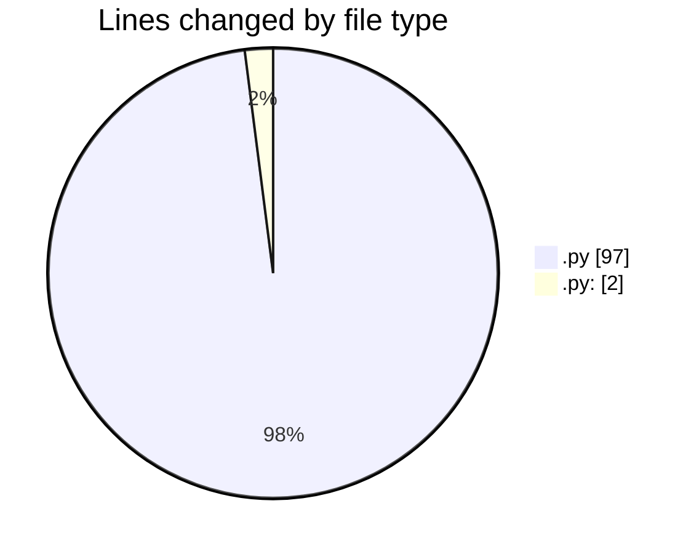
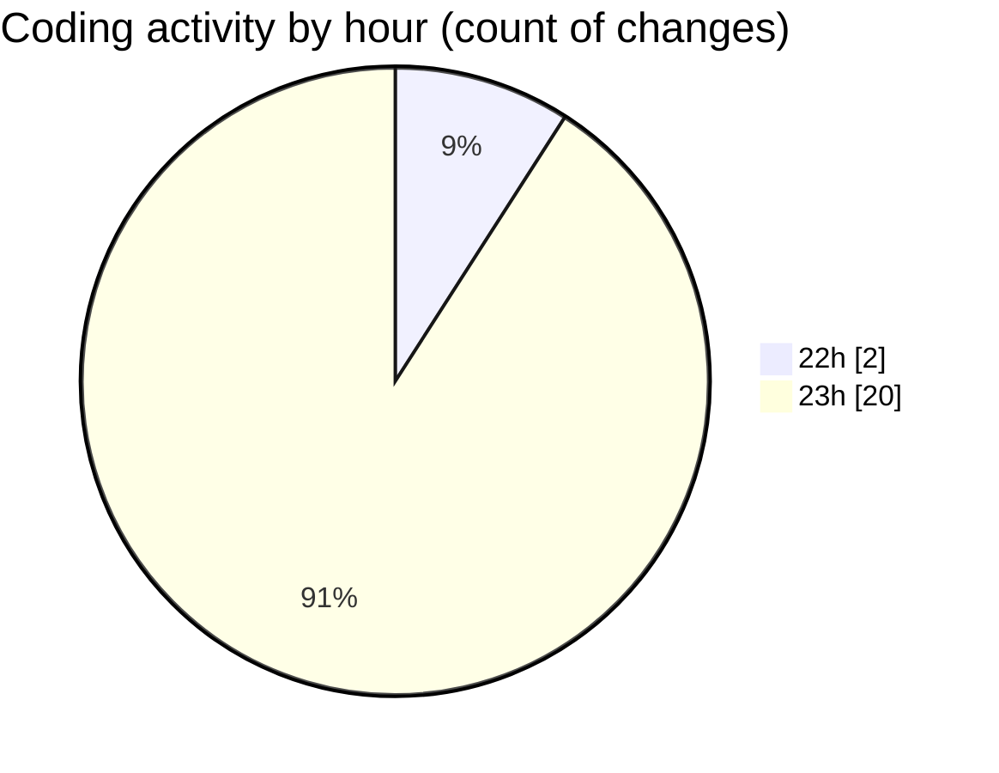

# samplePdf - Activity Summary 

## Overall Statistics

| Stat                   | Value                                                             |
| ---------------------- | ----------------------------------------------------------------- |
| **Lines Added** (➕)   | 93                                          |
| **Lines Removed** (➖) | 6                                        |
| **Net Change** (↕)    | 87                |
| **Active Time** (⌚)   | 39 minutes |

## Modified Files
- **file_upload.py** (+67, -5)
- **calculate_grand_totals.py:** (+2, -0)
- **calculate_grand_totals.py** (+24, -1)

## Visualizations

### By File Type (Lines Changed)

### By Hour (Estimated Activity Count)

> **Last Updated:** 22/02/2025, 23:22:19