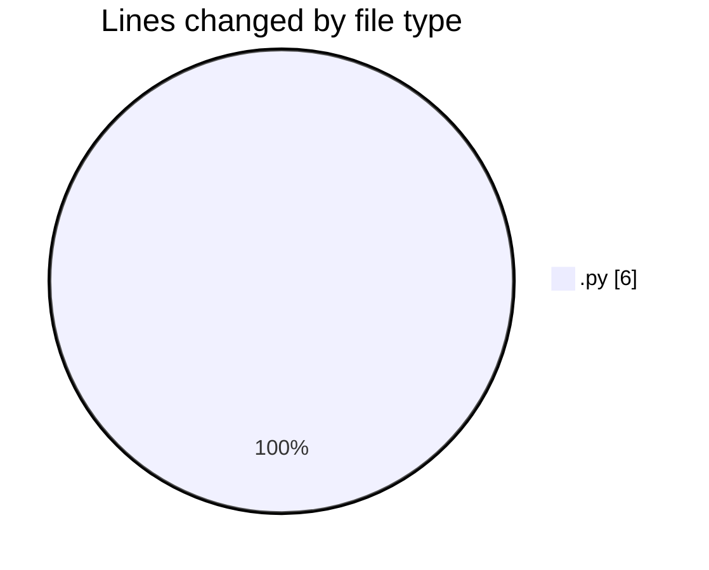
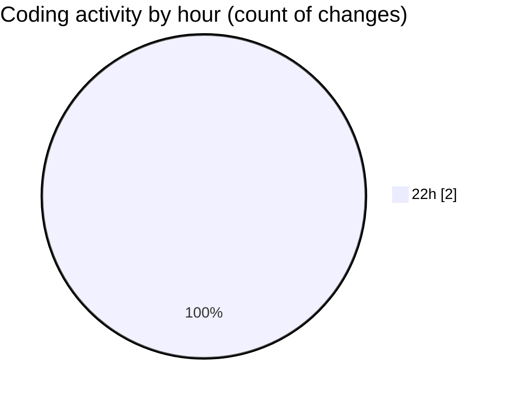

# samplePdf - Activity Summary 

## Overall Statistics

| Stat                   | Value                                                             |
| ---------------------- | ----------------------------------------------------------------- |
| **Lines Added** (➕)   | 4                                          |
| **Lines Removed** (➖) | 2                                        |
| **Net Change** (↕)    | 2                |
| **Active Time** (⌚)   | 5 minutes |

## Modified Files
- **file_upload.py** (+4, -2)

## Visualizations

### By File Type (Lines Changed)

### By Hour (Estimated Activity Count)

> **Last Updated:** 22/02/2025, 23:02:19