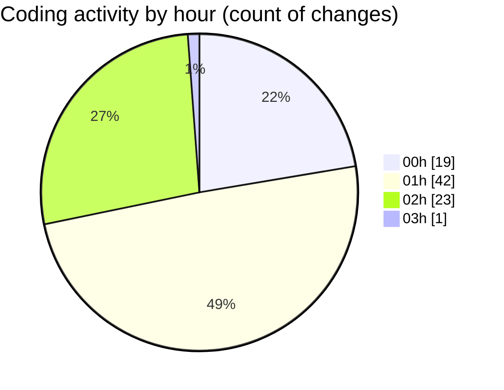

# pdf-analysis-app - Activity Summary 

## Overall Statistics

| Stat                   | Value                                                             |
| ---------------------- | ----------------------------------------------------------------- |
| **Lines Added** (➕)   | 1124                                          |
| **Lines Removed** (➖) | 144                                        |
| **Net Change** (↕)    | 980                |
| **Active Time** (⌚)   | 134 minutes |

## Modified Files
- **App.tsx** (+48, -8)
- **api.ts** (+78, -9)
- **package.json** (+46, -0)
- **tsconfig.json** (+8, -3)
- **tsconfig.app.json** (+31, -0)
- **tsconfig.node.json** (+24, -1)
- **FileUpload.test.tsx** (+129, -19)
- **Home.tsx** (+193, -56)
- **index.ts** (+152, -8)
- **InvoiceSection.tsx** (+147, -23)
- **FileUpload.tsx** (+231, -9)
- **socket.ts** (+26, -8)
- **.env** (+3, -0)
- **socketUrl.ts** (+8, -0)

## Visualizations

### By File Type (Lines Changed)

### By Hour (Estimated Activity Count)

> **Last Updated:** 23/02/2025, 03:09:09