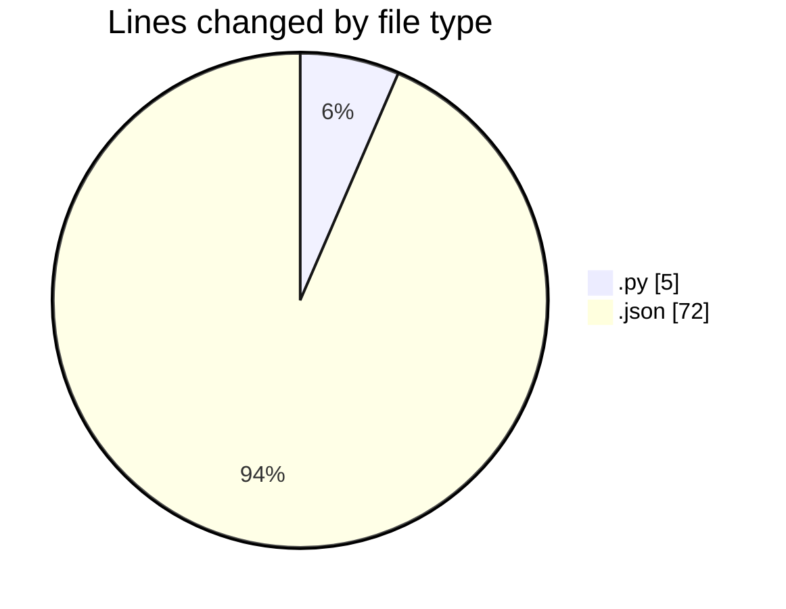

# samplePdf - Activity Summary 

## Overall Statistics

| Stat                   | Value                                                             |
| ---------------------- | ----------------------------------------------------------------- |
| **Lines Added** (➕)   | 75                                          |
| **Lines Removed** (➖) | 2                                        |
| **Net Change** (↕)    | 73                |
| **Active Time** (⌚)   | 5 minutes |

## Modified Files
- **calcSiteTotals.py** (+4, -1)
- **settings.json** (+71, -1)

## Visualizations

### By File Type (Lines Changed)

### By Hour (Estimated Activity Count)

> **Last Updated:** 23/02/2025, 00:12:19