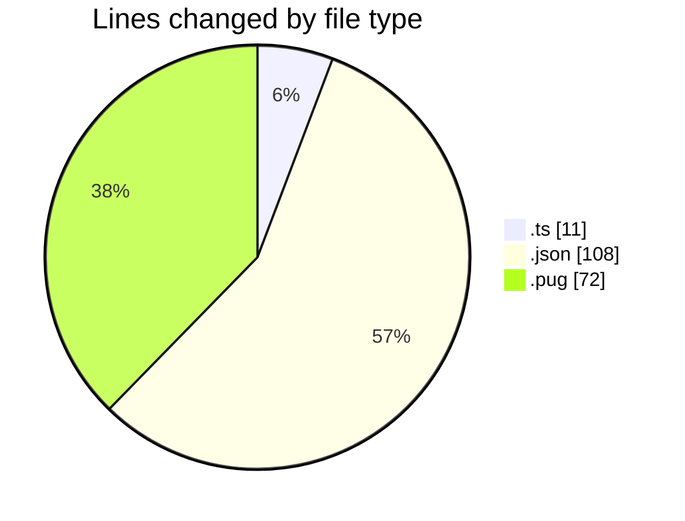
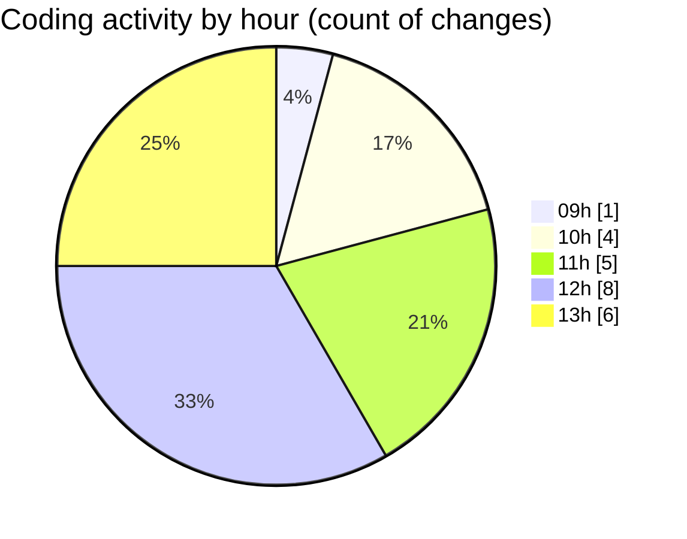

# cda - Activity Summary 

## Overall Statistics

| Stat                   | Value                                                             |
| ---------------------- | ----------------------------------------------------------------- |
| **Lines Added** (➕)   | 178                                          |
| **Lines Removed** (➖) | 13                                        |
| **Net Change** (↕)    | 165                |
| **Active Time** (⌚)   | 32 minutes |

## Modified Files
- **version.ts** (+11, -0)
- **duty-request.json** (+25, -9)
- **clearview.json** (+32, -0)
- **calendar.json** (+16, -0)
- **yesalert.json** (+15, -0)
- **html.pug** (+66, -4)
- **feedback.json** (+11, -0)
- **subject.pug** (+2, -0)

## Visualizations

### By File Type (Lines Changed)

### By Hour (Estimated Activity Count)

> **Last Updated:** 24/02/2025, 13:14:26