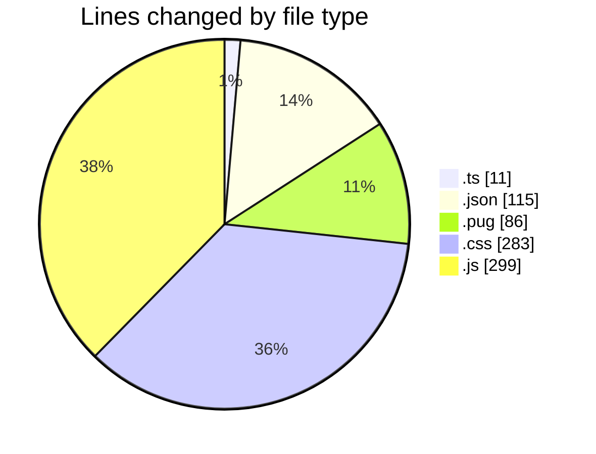
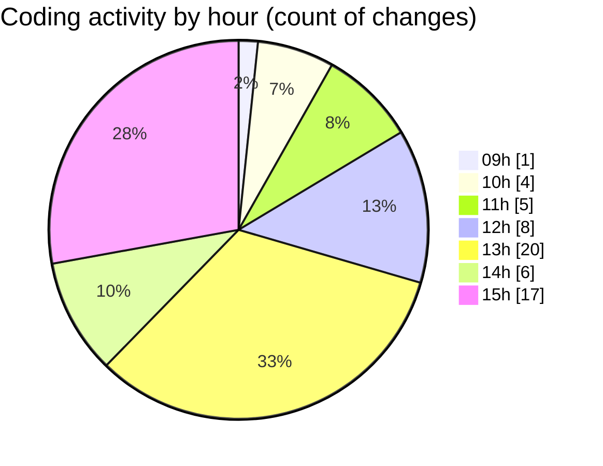

# cda - Activity Summary 

## Overall Statistics

| Stat                   | Value                                                             |
| ---------------------- | ----------------------------------------------------------------- |
| **Lines Added** (➕)   | 717                                          |
| **Lines Removed** (➖) | 77                                        |
| **Net Change** (↕)    | 640                |
| **Active Time** (⌚)   | 88 minutes |

## Modified Files
- **version.ts** (+11, -0)
- **duty-request.json** (+28, -13)
- **clearview.json** (+32, -0)
- **calendar.json** (+16, -0)
- **yesalert.json** (+15, -0)
- **html.pug** (+72, -10)
- **feedback.json** (+11, -0)
- **subject.pug** (+2, -0)
- **style.css** (+283, -0)
- **duty-request.js** (+112, -48)
- **subject.pug** (+2, -0)
- **dutyRequest.js** (+133, -6)

## Visualizations

### By File Type (Lines Changed)

### By Hour (Estimated Activity Count)

> **Last Updated:** 24/02/2025, 15:59:26