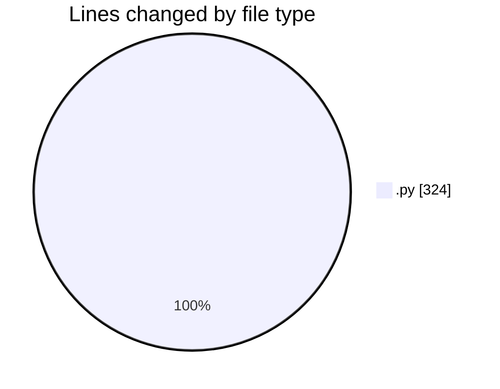
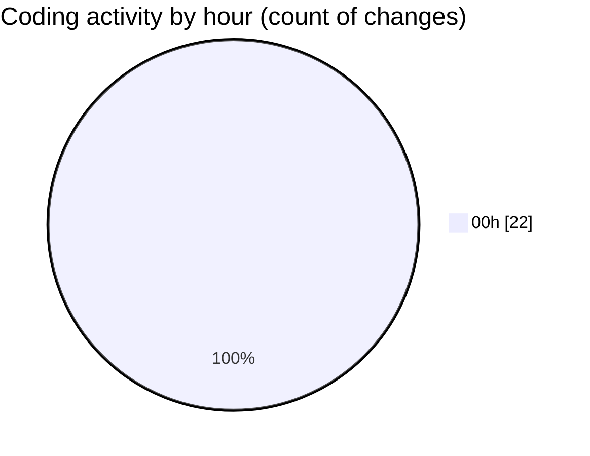

# samplePdf - Activity Summary 

## Overall Statistics

| Stat                   | Value                                                             |
| ---------------------- | ----------------------------------------------------------------- |
| **Lines Added** (➕)   | 312                                          |
| **Lines Removed** (➖) | 12                                        |
| **Net Change** (↕)    | 300                |
| **Active Time** (⌚)   | 24 minutes |

## Modified Files
- **file_upload.py** (+108, -1)
- **app.py** (+0, -7)
- **database_module.py** (+161, -0)
- **save_file_with_progress.py** (+43, -4)

## Visualizations

### By File Type (Lines Changed)

### By Hour (Estimated Activity Count)

> **Last Updated:** 24/02/2025, 00:57:18