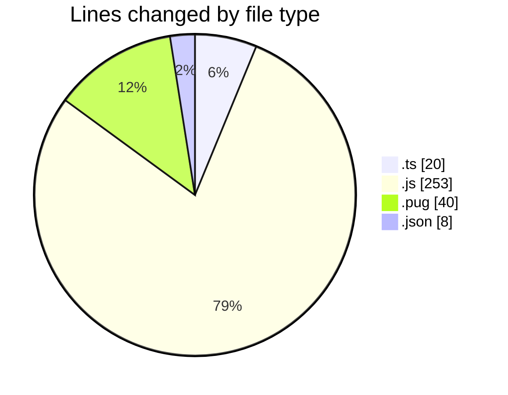
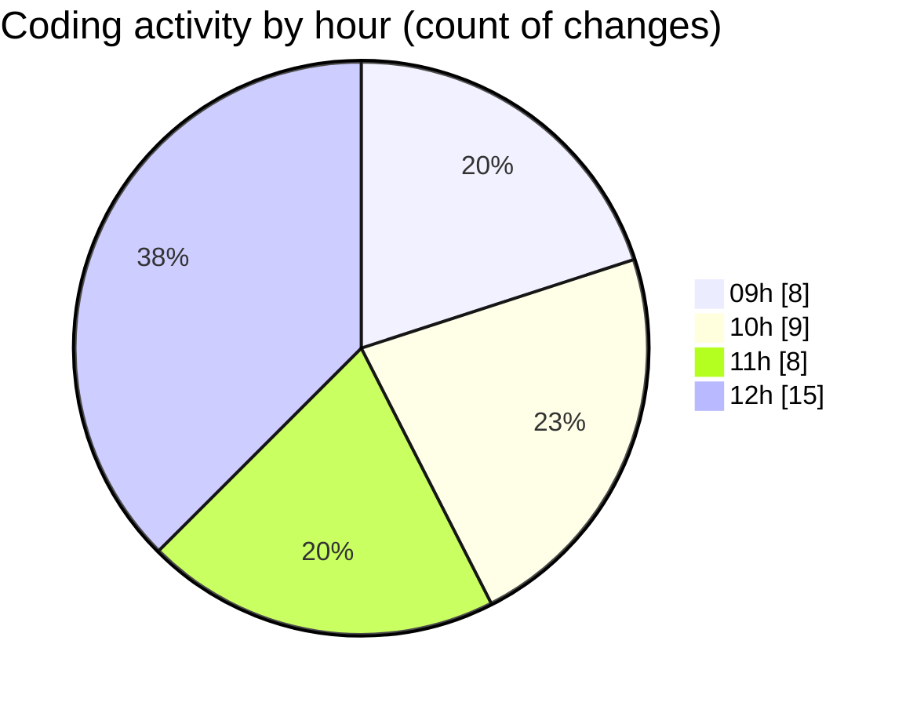

# cda - Activity Summary 

## Overall Statistics

| Stat                   | Value                                                             |
| ---------------------- | ----------------------------------------------------------------- |
| **Lines Added** (➕)   | 271                                          |
| **Lines Removed** (➖) | 50                                        |
| **Net Change** (↕)    | 221                |
| **Active Time** (⌚)   | 71 minutes |

## Modified Files
- **formatDate.ts** (+6, -6)
- **updateDutyRequest.ts** (+4, -4)
- **dutyRequest.js** (+229, -10)
- **html.pug** (+13, -27)
- **duty-request-status.json** (+5, -3)
- **duty-request.js** (+14, -0)

## Visualizations

### By File Type (Lines Changed)

### By Hour (Estimated Activity Count)

> **Last Updated:** 25/02/2025, 12:36:59