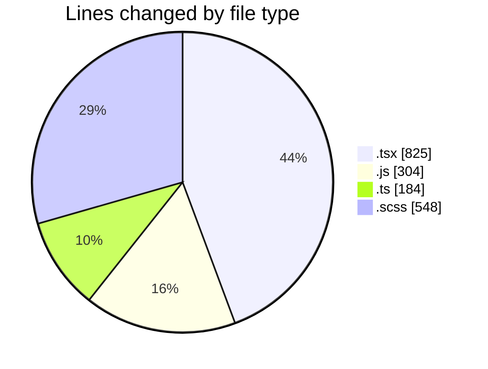
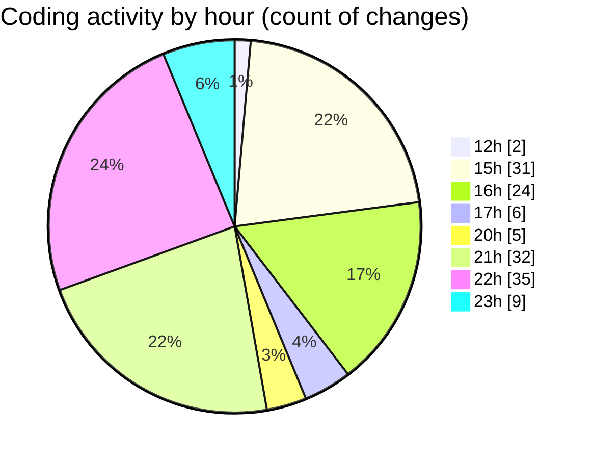

# cda - Activity Summary 

## Overall Statistics

| Stat                   | Value                                                             |
| ---------------------- | ----------------------------------------------------------------- |
| **Lines Added** (➕)   | 1393                                          |
| **Lines Removed** (➖) | 468                                        |
| **Net Change** (↕)    | 925                |
| **Active Time** (⌚)   | 200 minutes |

## Modified Files
- **Admin.tsx** (+55, -3)
- **dutyRequest.js** (+192, -0)
- **duty-request.js** (+88, -24)
- **App.tsx** (+58, -10)
- **createDutyRequest.ts** (+76, -0)
- **updateDutyRequest.ts** (+97, -0)
- **RequestWrapper.tsx** (+64, -2)
- **index.ts** (+3, -0)
- **RequestCard.test.tsx** (+47, -0)
- **RequestViewRow.tsx** (+236, -133)
- **RequestViewRow.test.tsx** (+71, -31)
- **RequestViewRow.scss** (+44, -43)
- **index.ts** (+3, -0)
- **SummarySection.tsx** (+59, -18)
- **index.ts** (+4, -1)
- **SummaryMetric.tsx** (+38, -0)
- **SummaryMetric.scss** (+233, -185)
- **SummarySection.scss** (+25, -18)

## Visualizations

### By File Type (Lines Changed)

### By Hour (Estimated Activity Count)

> **Last Updated:** 26/02/2025, 23:11:48