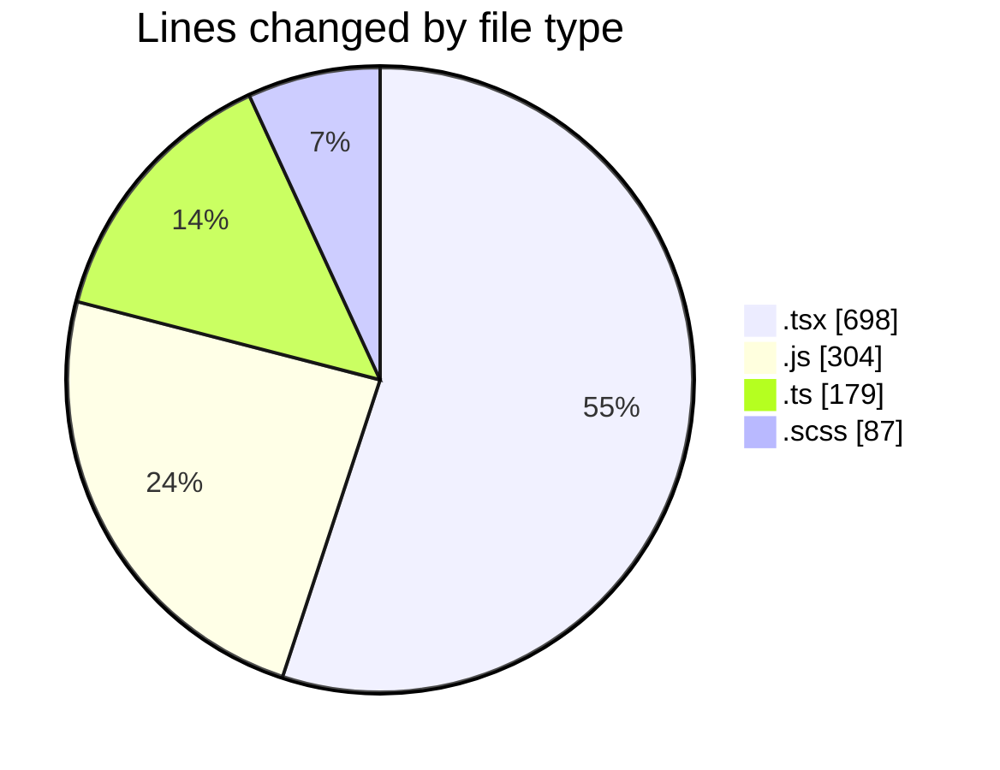
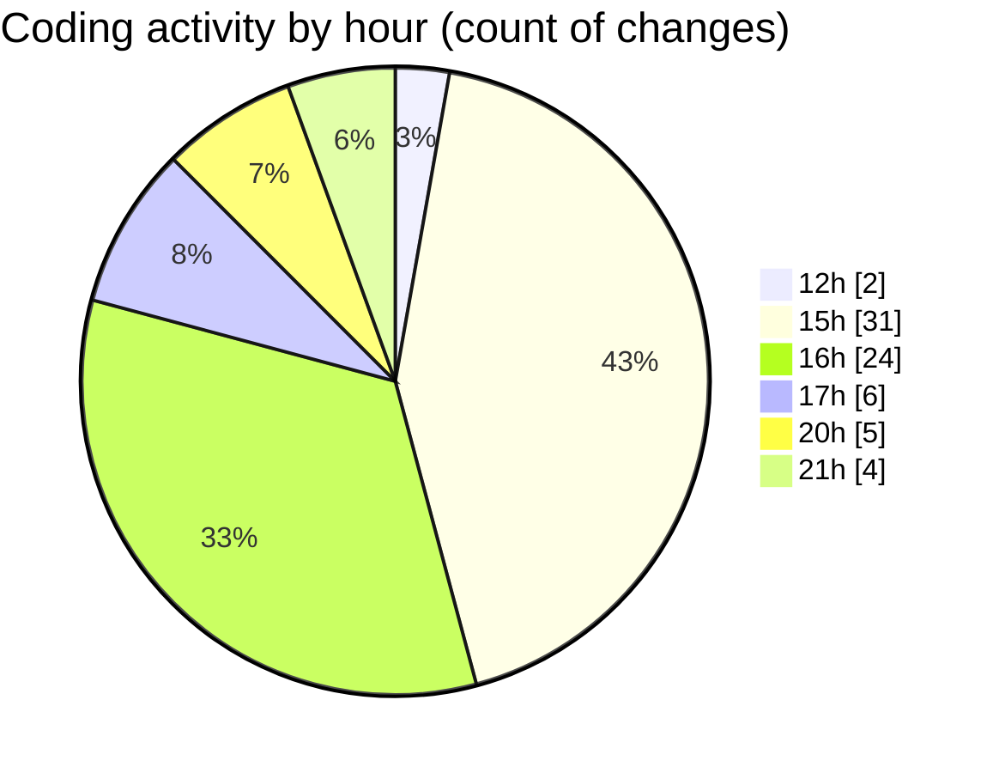

# cda - Activity Summary 

## Overall Statistics

| Stat                   | Value                                                             |
| ---------------------- | ----------------------------------------------------------------- |
| **Lines Added** (➕)   | 1023                                          |
| **Lines Removed** (➖) | 245                                        |
| **Net Change** (↕)    | 778                |
| **Active Time** (⌚)   | 100 minutes |

## Modified Files
- **Admin.tsx** (+38, -2)
- **dutyRequest.js** (+192, -0)
- **duty-request.js** (+88, -24)
- **App.tsx** (+58, -10)
- **createDutyRequest.ts** (+76, -0)
- **updateDutyRequest.ts** (+97, -0)
- **RequestWrapper.tsx** (+64, -2)
- **index.ts** (+3, -0)
- **RequestCard.test.tsx** (+47, -0)
- **RequestViewRow.tsx** (+236, -133)
- **RequestViewRow.test.tsx** (+71, -31)
- **RequestViewRow.scss** (+44, -43)
- **index.ts** (+3, -0)
- **SummarySection.tsx** (+6, -0)

## Visualizations

### By File Type (Lines Changed)

### By Hour (Estimated Activity Count)

> **Last Updated:** 26/02/2025, 21:26:48