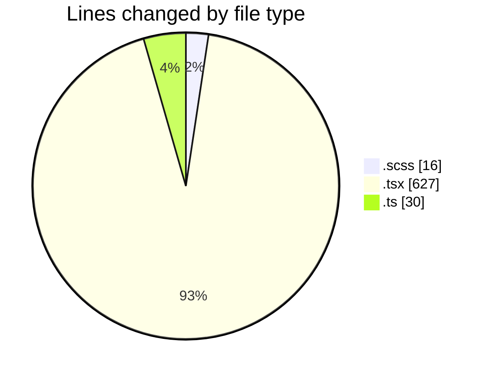
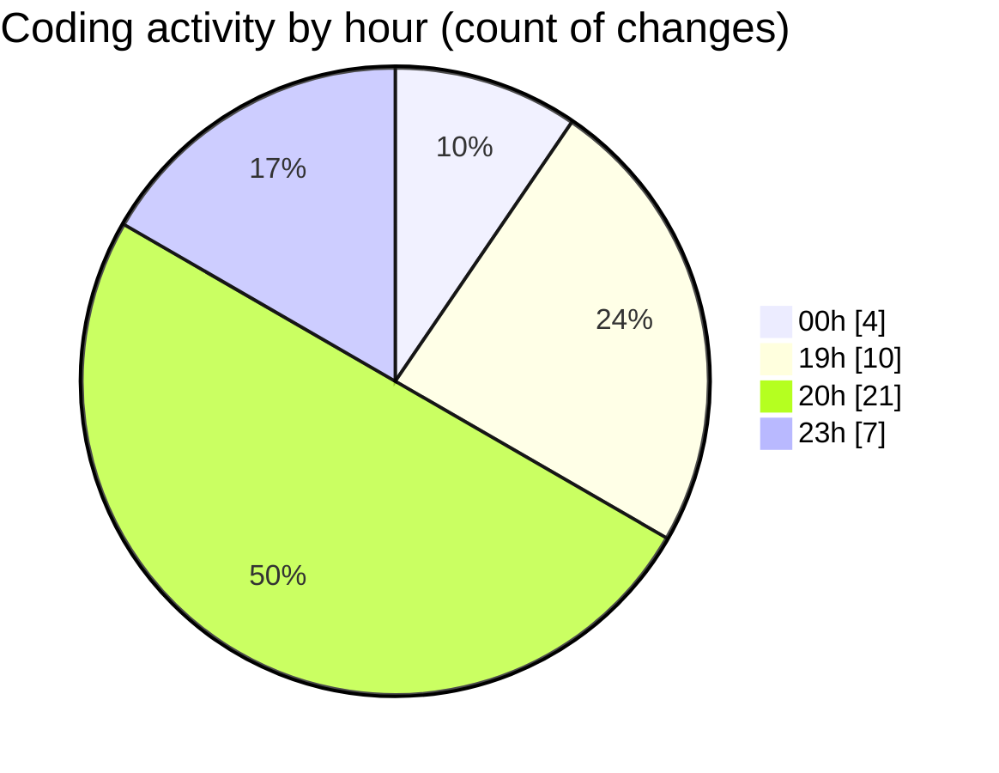

# cda - Activity Summary 

## Overall Statistics

| Stat                   | Value                                                             |
| ---------------------- | ----------------------------------------------------------------- |
| **Lines Added** (➕)   | 446                                          |
| **Lines Removed** (➖) | 227                                        |
| **Net Change** (↕)    | 219                |
| **Active Time** (⌚)   | 60 minutes |

## Modified Files
- **FilterBar.scss** (+16, -0)
- **Filter.tsx** (+61, -0)
- **FilterButton.tsx** (+84, -18)
- **index.ts** (+4, -0)
- **FilterBar.tsx** (+77, -57)
- **FilterTab.tsx** (+71, -46)
- **Admin.tsx** (+107, -106)
- **types.ts** (+26, -0)

## Visualizations

### By File Type (Lines Changed)

### By Hour (Estimated Activity Count)

> **Last Updated:** 27/02/2025, 20:31:06