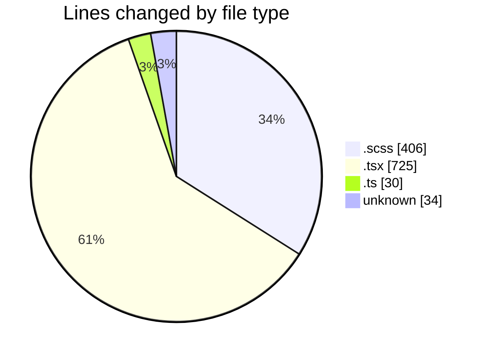
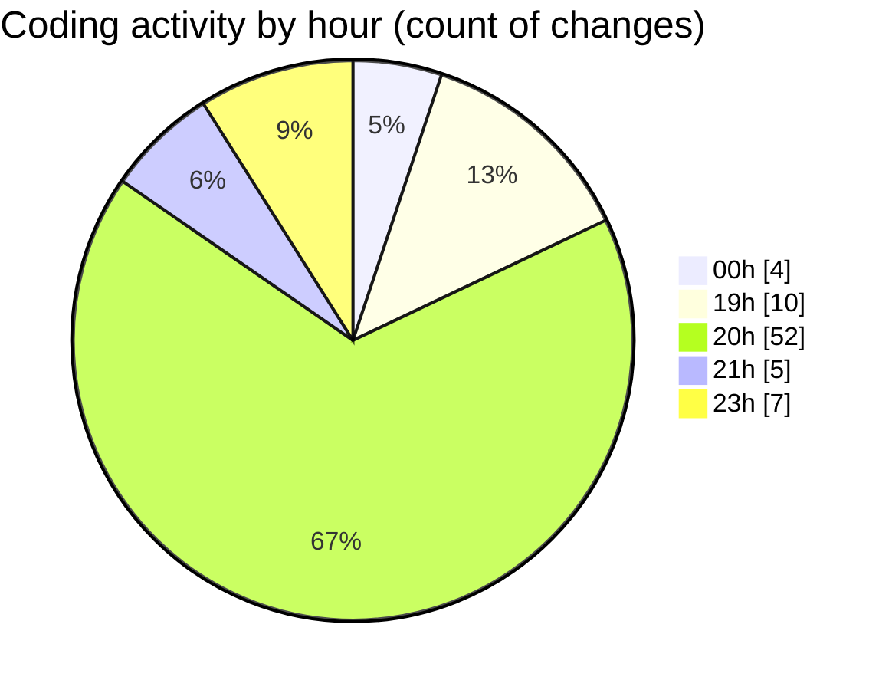

# cda - Activity Summary 

## Overall Statistics

| Stat                   | Value                                                             |
| ---------------------- | ----------------------------------------------------------------- |
| **Lines Added** (➕)   | 801                                          |
| **Lines Removed** (➖) | 394                                        |
| **Net Change** (↕)    | 407                |
| **Active Time** (⌚)   | 116 minutes |

## Modified Files
- **FilterBar.scss** (+56, -5)
- **Filter.tsx** (+61, -0)
- **FilterButton.tsx** (+84, -18)
- **index.ts** (+4, -0)
- **FilterBar.tsx** (+94, -95)
- **FilterTab.tsx** (+76, -46)
- **Admin.tsx** (+134, -117)
- **types.ts** (+26, -0)
- **FilterTab.scss** (+18, -0)
- **SummarySection.scss** (+92, -49)
- **RequestViewRow.scss** (+124, -62)
- **.env** (+32, -2)

## Visualizations

### By File Type (Lines Changed)

### By Hour (Estimated Activity Count)

> **Last Updated:** 27/02/2025, 21:12:38