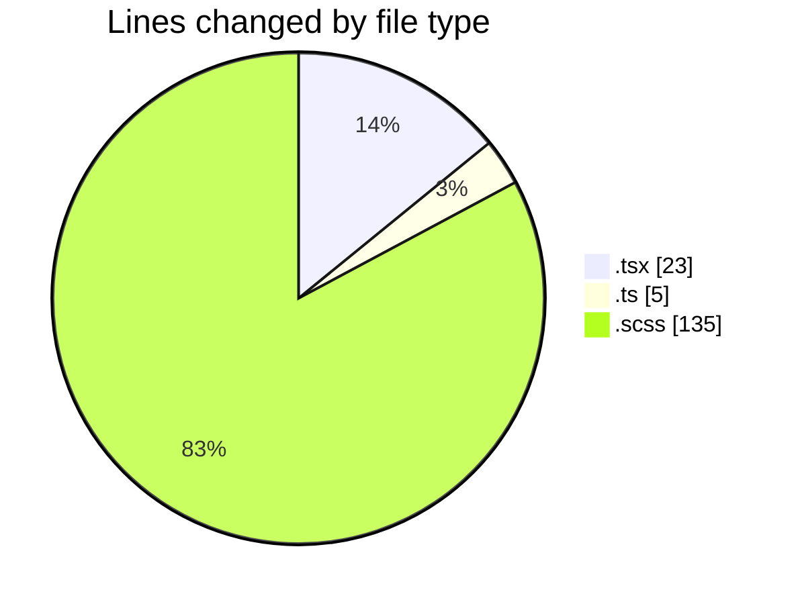
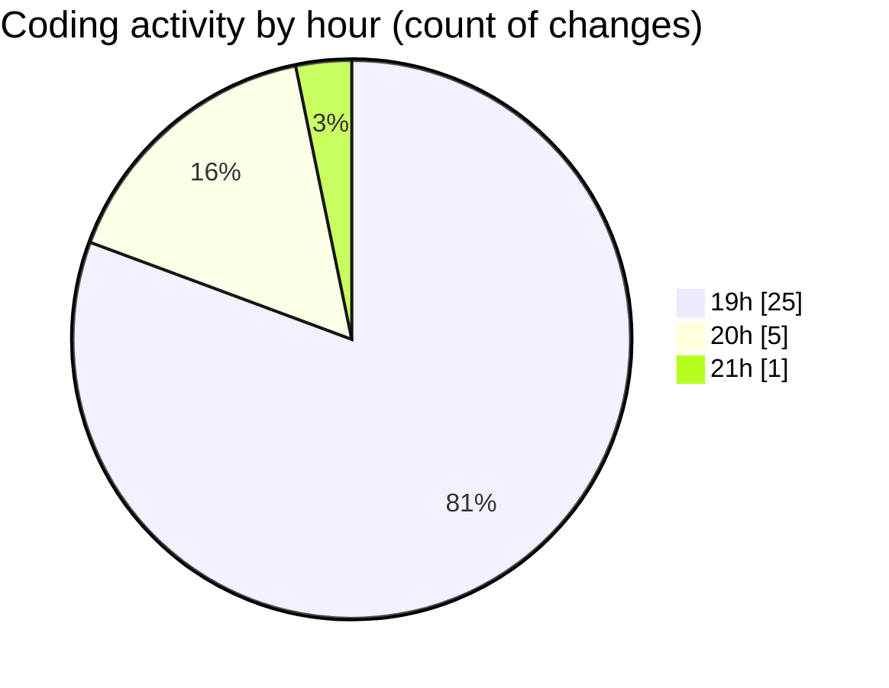

# cda - Activity Summary 

## Overall Statistics

| Stat                   | Value                                                             |
| ---------------------- | ----------------------------------------------------------------- |
| **Lines Added** (➕)   | 120                                          |
| **Lines Removed** (➖) | 43                                        |
| **Net Change** (↕)    | 77                |
| **Active Time** (⌚)   | 42 minutes |

## Modified Files
- **StaticCard.tsx** (+11, -4)
- **index.ts** (+4, -1)
- **SummarySection.tsx** (+2, -2)
- **SummaryMetric.scss** (+101, -34)
- **SummaryMetric.tsx** (+2, -2)

## Visualizations

### By File Type (Lines Changed)

### By Hour (Estimated Activity Count)

> **Last Updated:** 28/02/2025, 21:01:56