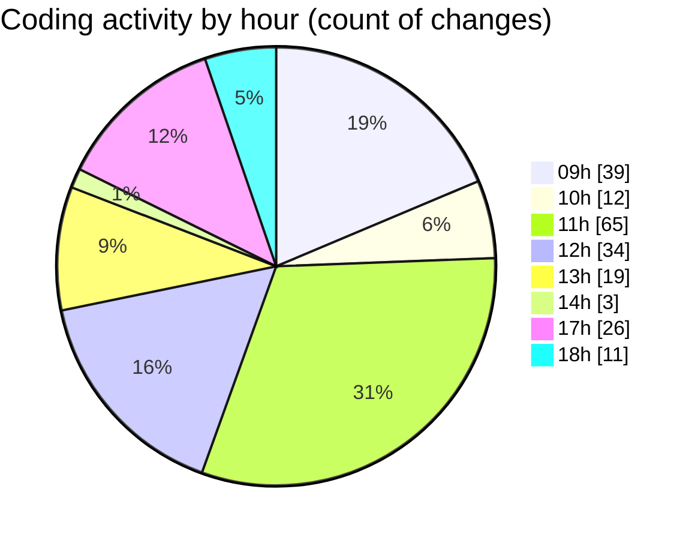

# cda - Activity Summary 

## Overall Statistics

| Stat                   | Value                                                             |
| ---------------------- | ----------------------------------------------------------------- |
| **Lines Added** (➕)   | 777                                          |
| **Lines Removed** (➖) | 431                                        |
| **Net Change** (↕)    | 346                |
| **Active Time** (⌚)   | 315 minutes |

## Modified Files
- **RequestHeader.scss** (+27, -26)
- **FilterTab.scss** (+0, -7)
- **RequestViewRow.tsx** (+409, -229)
- **RequestViewRow.scss** (+150, -95)
- **Admin.tsx** (+159, -74)
- **types.ts** (+32, -0)

## Visualizations

### By File Type (Lines Changed)

### By Hour (Estimated Activity Count)

> **Last Updated:** 04/03/2025, 18:07:43