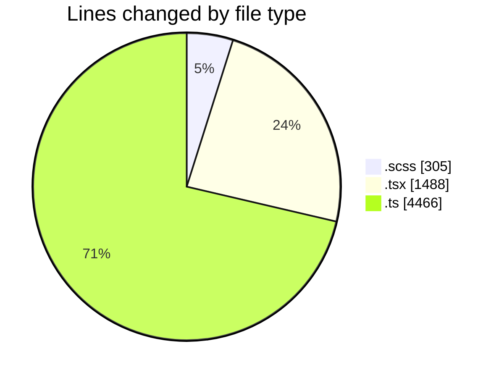
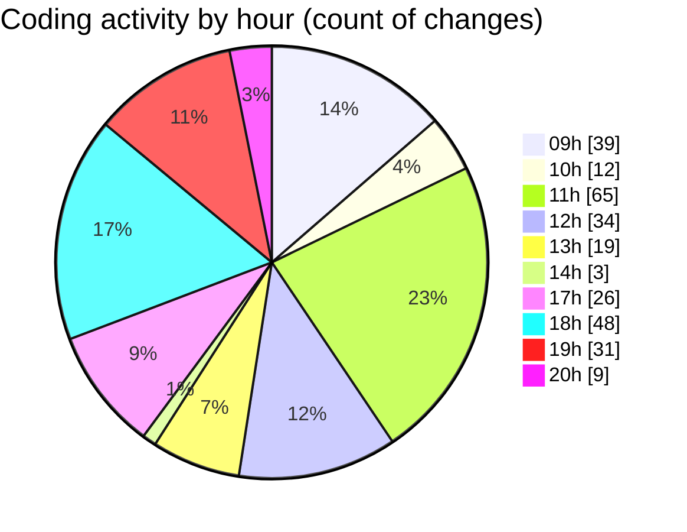

# cda - Activity Summary 

## Overall Statistics

| Stat                   | Value                                                             |
| ---------------------- | ----------------------------------------------------------------- |
| **Lines Added** (➕)   | 5716                                          |
| **Lines Removed** (➖) | 543                                        |
| **Net Change** (↕)    | 5173                |
| **Active Time** (⌚)   | 437 minutes |

## Modified Files
- **RequestHeader.scss** (+27, -26)
- **FilterTab.scss** (+0, -7)
- **RequestViewRow.tsx** (+457, -264)
- **RequestViewRow.scss** (+150, -95)
- **Admin.tsx** (+240, -94)
- **types.ts** (+32, -0)
- **RequestView.test.tsx** (+40, -0)
- **index.ts** (+3, -0)
- **RequestView.tsx** (+198, -18)
- **RequestView.test.tsx** (+40, -0)
- **FilterTab.tsx** (+62, -0)
- **RequestHeader.tsx** (+36, -39)
- **graphql.ts** (+4431, -0)

## Visualizations

### By File Type (Lines Changed)

### By Hour (Estimated Activity Count)

> **Last Updated:** 04/03/2025, 20:17:43